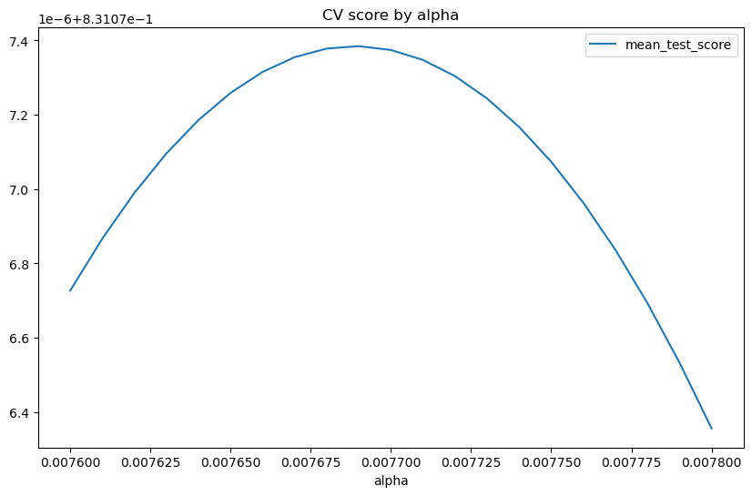
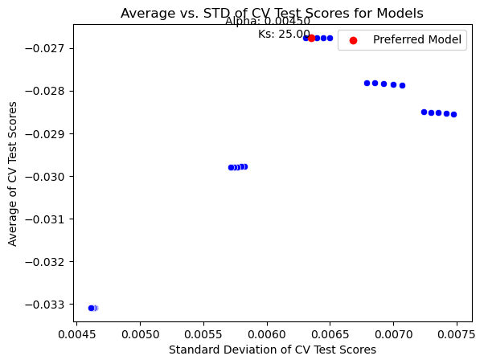

```python
import pandas as pd
import numpy as np
from sklearn import preprocessing
from sklearn.preprocessing import OneHotEncoder, LabelEncoder,StandardScaler
from sklearn.compose import ColumnTransformer, make_column_selector,make_column_transformer
from sklearn.pipeline import make_pipeline,Pipeline 
from sklearn.impute import SimpleImputer
from df_after_transform import df_after_transform
from sklearn.model_selection import KFold, cross_validate, GridSearchCV, cross_val_score,train_test_split
from sklearn.linear_model import Lasso,Ridge
from sklearn.metrics import r2_score
import matplotlib.pyplot as plt
import seaborn as sns
from sklearn.feature_selection import SelectKBest, f_classif,f_regression


from sklearn import set_config
set_config(display="diagram")  # display='text' is the default

pd.set_option('display.max_colwidth', 1000, 'display.max_rows', 50, 'display.max_columns', None) 
```

## Machine Learning Practice

Objective: After this assignment, you can build a pipeline that
1. Preprocesses realistic data (multiple variable types) in a pipeline that handles each variable type
1. Estimates a model using CV
1. Hypertunes a model on a CV folds within training sample
1. Finally, evaluate its performance in the test sample

Let's start by loading the data


```python


# load data and split off X and y
housing = pd.read_csv('input_data2/housing_train.csv')
y = np.log(housing.v_SalePrice)
housing = housing.drop('v_SalePrice',axis=1)
```

To ensure you can be graded accurately, we need to make the "randomness" predictable. (I.e. you should get the exact same answers every single time we run this.)

Per the recommendations in the [sk-learn documentation](https://scikit-learn.org/stable/common_pitfalls.html#general-recommendations), what that means is we need to put `random_state=rng` inside every function in this file that accepts "random_state" as an argument.


```python
# create test set for use later - notice the (random_state=rng)
rng = np.random.RandomState(0)
X_train, X_test, y_train, y_test = train_test_split(housing, y, random_state=rng)
```

## Part 1: Preprocessing the data

1. Set up a single pipeline called `preproc_pipe` to preprocess the data.
    1. For **all** numerical variables, impute missing values with SimpleImputer and scale them with StandardScaler
    1. `v_Lot_Config`: Use OneHotEncoder on it 
    1. Drop any other variables (handle this **inside** the pipeline)
1. Use this pipeline to preprocess X_train. 
    1. Describe the resulting data **with two digits.**
    1. How many columns are in this object?

_HINTS:_
- _You do NOT need to type the names of all variables. There is a lil trick to catch all the variables._
- _The first few rows of my print out look like this:_

| | count | mean | std | min  | 25%  | 50% |  75% |  max
| --- | --- | --- | ---  | ---  | --- |  --- |  --- |  ---
|  v_MS_SubClass | 1455 | 0 | 1 | -0.89 | -0.89 | -0.2 | 0.26 | 3.03
|  v_Lot_Frontage | 1455 | 0 | 1 | -2.2 | -0.43 | 0 | 0.39 | 11.07
|  v_Lot_Area  | 1455 | 0 | 1 | -1.17 | -0.39 | -0.11 | 0.19 | 20.68
| v_Overall_Qual | 1455 | 0 | 1 | -3.7 | -0.81 | -0.09 | 0.64 | 2.8


```python
#1
#initialize pipes
numer_pipe = make_pipeline(SimpleImputer(strategy = 'mean'),
                        StandardScaler())
cat_pipe = make_pipeline(OneHotEncoder(drop = 'first'))


# find all numerics
num_pipe_features = X_train.select_dtypes(include=['number']).columns

#create preproc_pipe
preproc_pipe = make_column_transformer(
    (numer_pipe,num_pipe_features),
    (cat_pipe, ['v_Lot_Config']),
    remainder = 'drop',
)

```


```python
from df_after_transform import df_after_transform

preproc_df = df_after_transform(preproc_pipe,X_train)
print(f'There are {preproc_df.shape[1]} columns in the preprocessed data.')
preproc_df.describe().T.round(2)
```

    There are 40 columns in the preprocessed data.


<div>
<style scoped>
    .dataframe tbody tr th:only-of-type {
        vertical-align: middle;
    }

    .dataframe tbody tr th {
        vertical-align: top;
    }

    .dataframe thead th {
        text-align: right;
    }
</style>
<table border="1" class="dataframe">
  <thead>
    <tr style="text-align: right;">
      <th></th>
      <th>count</th>
      <th>mean</th>
      <th>std</th>
      <th>min</th>
      <th>25%</th>
      <th>50%</th>
      <th>75%</th>
      <th>max</th>
    </tr>
  </thead>
  <tbody>
    <tr>
      <th>v_MS_SubClass</th>
      <td>1455.0</td>
      <td>0.00</td>
      <td>1.00</td>
      <td>-0.89</td>
      <td>-0.89</td>
      <td>-0.20</td>
      <td>0.26</td>
      <td>3.03</td>
    </tr>
    <tr>
      <th>v_Lot_Frontage</th>
      <td>1455.0</td>
      <td>0.00</td>
      <td>1.00</td>
      <td>-2.20</td>
      <td>-0.43</td>
      <td>0.00</td>
      <td>0.39</td>
      <td>11.07</td>
    </tr>
    <tr>
      <th>v_Lot_Area</th>
      <td>1455.0</td>
      <td>0.00</td>
      <td>1.00</td>
      <td>-1.17</td>
      <td>-0.39</td>
      <td>-0.11</td>
      <td>0.19</td>
      <td>20.68</td>
    </tr>
    <tr>
      <th>v_Overall_Qual</th>
      <td>1455.0</td>
      <td>0.00</td>
      <td>1.00</td>
      <td>-3.70</td>
      <td>-0.81</td>
      <td>-0.09</td>
      <td>0.64</td>
      <td>2.80</td>
    </tr>
    <tr>
      <th>v_Overall_Cond</th>
      <td>1455.0</td>
      <td>0.00</td>
      <td>1.00</td>
      <td>-4.30</td>
      <td>-0.53</td>
      <td>-0.53</td>
      <td>0.41</td>
      <td>3.24</td>
    </tr>
    <tr>
      <th>v_Year_Built</th>
      <td>1455.0</td>
      <td>-0.00</td>
      <td>1.00</td>
      <td>-3.08</td>
      <td>-0.62</td>
      <td>0.05</td>
      <td>0.98</td>
      <td>1.22</td>
    </tr>
    <tr>
      <th>v_Year_Remod/Add</th>
      <td>1455.0</td>
      <td>0.00</td>
      <td>1.00</td>
      <td>-1.63</td>
      <td>-0.91</td>
      <td>0.43</td>
      <td>0.96</td>
      <td>1.20</td>
    </tr>
    <tr>
      <th>v_Mas_Vnr_Area</th>
      <td>1455.0</td>
      <td>0.00</td>
      <td>1.00</td>
      <td>-0.57</td>
      <td>-0.57</td>
      <td>-0.57</td>
      <td>0.33</td>
      <td>7.87</td>
    </tr>
    <tr>
      <th>v_BsmtFin_SF_1</th>
      <td>1455.0</td>
      <td>0.00</td>
      <td>1.00</td>
      <td>-0.96</td>
      <td>-0.96</td>
      <td>-0.16</td>
      <td>0.65</td>
      <td>11.20</td>
    </tr>
    <tr>
      <th>v_BsmtFin_SF_2</th>
      <td>1455.0</td>
      <td>0.00</td>
      <td>1.00</td>
      <td>-0.29</td>
      <td>-0.29</td>
      <td>-0.29</td>
      <td>-0.29</td>
      <td>8.29</td>
    </tr>
    <tr>
      <th>v_Bsmt_Unf_SF</th>
      <td>1455.0</td>
      <td>0.00</td>
      <td>1.00</td>
      <td>-1.28</td>
      <td>-0.77</td>
      <td>-0.23</td>
      <td>0.55</td>
      <td>3.58</td>
    </tr>
    <tr>
      <th>v_Total_Bsmt_SF</th>
      <td>1455.0</td>
      <td>0.00</td>
      <td>1.00</td>
      <td>-2.39</td>
      <td>-0.59</td>
      <td>-0.14</td>
      <td>0.55</td>
      <td>11.35</td>
    </tr>
    <tr>
      <th>v_1st_Flr_SF</th>
      <td>1455.0</td>
      <td>-0.00</td>
      <td>1.00</td>
      <td>-2.07</td>
      <td>-0.68</td>
      <td>-0.19</td>
      <td>0.55</td>
      <td>9.76</td>
    </tr>
    <tr>
      <th>v_2nd_Flr_SF</th>
      <td>1455.0</td>
      <td>-0.00</td>
      <td>1.00</td>
      <td>-0.78</td>
      <td>-0.78</td>
      <td>-0.78</td>
      <td>0.85</td>
      <td>3.98</td>
    </tr>
    <tr>
      <th>v_Low_Qual_Fin_SF</th>
      <td>1455.0</td>
      <td>0.00</td>
      <td>1.00</td>
      <td>-0.09</td>
      <td>-0.09</td>
      <td>-0.09</td>
      <td>-0.09</td>
      <td>14.09</td>
    </tr>
    <tr>
      <th>v_Gr_Liv_Area</th>
      <td>1455.0</td>
      <td>-0.00</td>
      <td>1.00</td>
      <td>-2.23</td>
      <td>-0.72</td>
      <td>-0.14</td>
      <td>0.43</td>
      <td>7.82</td>
    </tr>
    <tr>
      <th>v_Bsmt_Full_Bath</th>
      <td>1455.0</td>
      <td>-0.00</td>
      <td>1.00</td>
      <td>-0.82</td>
      <td>-0.82</td>
      <td>-0.82</td>
      <td>1.11</td>
      <td>3.04</td>
    </tr>
    <tr>
      <th>v_Bsmt_Half_Bath</th>
      <td>1455.0</td>
      <td>-0.00</td>
      <td>1.00</td>
      <td>-0.24</td>
      <td>-0.24</td>
      <td>-0.24</td>
      <td>-0.24</td>
      <td>7.94</td>
    </tr>
    <tr>
      <th>v_Full_Bath</th>
      <td>1455.0</td>
      <td>0.00</td>
      <td>1.00</td>
      <td>-2.84</td>
      <td>-1.03</td>
      <td>0.78</td>
      <td>0.78</td>
      <td>2.59</td>
    </tr>
    <tr>
      <th>v_Half_Bath</th>
      <td>1455.0</td>
      <td>0.00</td>
      <td>1.00</td>
      <td>-0.76</td>
      <td>-0.76</td>
      <td>-0.76</td>
      <td>1.25</td>
      <td>3.26</td>
    </tr>
    <tr>
      <th>v_Bedroom_AbvGr</th>
      <td>1455.0</td>
      <td>0.00</td>
      <td>1.00</td>
      <td>-3.51</td>
      <td>-1.07</td>
      <td>0.15</td>
      <td>0.15</td>
      <td>6.24</td>
    </tr>
    <tr>
      <th>v_Kitchen_AbvGr</th>
      <td>1455.0</td>
      <td>-0.00</td>
      <td>1.00</td>
      <td>-5.17</td>
      <td>-0.19</td>
      <td>-0.19</td>
      <td>-0.19</td>
      <td>4.78</td>
    </tr>
    <tr>
      <th>v_TotRms_AbvGrd</th>
      <td>1455.0</td>
      <td>-0.00</td>
      <td>1.00</td>
      <td>-2.83</td>
      <td>-0.93</td>
      <td>-0.30</td>
      <td>0.33</td>
      <td>5.39</td>
    </tr>
    <tr>
      <th>v_Fireplaces</th>
      <td>1455.0</td>
      <td>-0.00</td>
      <td>1.00</td>
      <td>-0.94</td>
      <td>-0.94</td>
      <td>0.63</td>
      <td>0.63</td>
      <td>5.32</td>
    </tr>
    <tr>
      <th>v_Garage_Yr_Blt</th>
      <td>1455.0</td>
      <td>-0.00</td>
      <td>1.00</td>
      <td>-3.41</td>
      <td>-0.67</td>
      <td>0.00</td>
      <td>0.97</td>
      <td>1.22</td>
    </tr>
    <tr>
      <th>v_Garage_Cars</th>
      <td>1455.0</td>
      <td>-0.00</td>
      <td>1.00</td>
      <td>-2.34</td>
      <td>-1.03</td>
      <td>0.28</td>
      <td>0.28</td>
      <td>2.91</td>
    </tr>
    <tr>
      <th>v_Garage_Area</th>
      <td>1455.0</td>
      <td>-0.00</td>
      <td>1.00</td>
      <td>-2.20</td>
      <td>-0.69</td>
      <td>0.01</td>
      <td>0.46</td>
      <td>4.65</td>
    </tr>
    <tr>
      <th>v_Wood_Deck_SF</th>
      <td>1455.0</td>
      <td>0.00</td>
      <td>1.00</td>
      <td>-0.74</td>
      <td>-0.74</td>
      <td>-0.74</td>
      <td>0.59</td>
      <td>10.54</td>
    </tr>
    <tr>
      <th>v_Open_Porch_SF</th>
      <td>1455.0</td>
      <td>-0.00</td>
      <td>1.00</td>
      <td>-0.71</td>
      <td>-0.71</td>
      <td>-0.31</td>
      <td>0.32</td>
      <td>7.67</td>
    </tr>
    <tr>
      <th>v_Enclosed_Porch</th>
      <td>1455.0</td>
      <td>-0.00</td>
      <td>1.00</td>
      <td>-0.36</td>
      <td>-0.36</td>
      <td>-0.36</td>
      <td>-0.36</td>
      <td>9.33</td>
    </tr>
    <tr>
      <th>v_3Ssn_Porch</th>
      <td>1455.0</td>
      <td>0.00</td>
      <td>1.00</td>
      <td>-0.09</td>
      <td>-0.09</td>
      <td>-0.09</td>
      <td>-0.09</td>
      <td>19.74</td>
    </tr>
    <tr>
      <th>v_Screen_Porch</th>
      <td>1455.0</td>
      <td>-0.00</td>
      <td>1.00</td>
      <td>-0.29</td>
      <td>-0.29</td>
      <td>-0.29</td>
      <td>-0.29</td>
      <td>9.69</td>
    </tr>
    <tr>
      <th>v_Pool_Area</th>
      <td>1455.0</td>
      <td>-0.00</td>
      <td>1.00</td>
      <td>-0.08</td>
      <td>-0.08</td>
      <td>-0.08</td>
      <td>-0.08</td>
      <td>17.05</td>
    </tr>
    <tr>
      <th>v_Misc_Val</th>
      <td>1455.0</td>
      <td>-0.00</td>
      <td>1.00</td>
      <td>-0.09</td>
      <td>-0.09</td>
      <td>-0.09</td>
      <td>-0.09</td>
      <td>24.19</td>
    </tr>
    <tr>
      <th>v_Mo_Sold</th>
      <td>1455.0</td>
      <td>-0.00</td>
      <td>1.00</td>
      <td>-2.03</td>
      <td>-0.55</td>
      <td>-0.18</td>
      <td>0.56</td>
      <td>2.04</td>
    </tr>
    <tr>
      <th>v_Yr_Sold</th>
      <td>1455.0</td>
      <td>-0.00</td>
      <td>1.00</td>
      <td>-1.24</td>
      <td>-1.24</td>
      <td>0.00</td>
      <td>1.25</td>
      <td>1.25</td>
    </tr>
    <tr>
      <th>v_Lot_Config_CulDSac</th>
      <td>1455.0</td>
      <td>0.06</td>
      <td>0.24</td>
      <td>0.00</td>
      <td>0.00</td>
      <td>0.00</td>
      <td>0.00</td>
      <td>1.00</td>
    </tr>
    <tr>
      <th>v_Lot_Config_FR2</th>
      <td>1455.0</td>
      <td>0.02</td>
      <td>0.15</td>
      <td>0.00</td>
      <td>0.00</td>
      <td>0.00</td>
      <td>0.00</td>
      <td>1.00</td>
    </tr>
    <tr>
      <th>v_Lot_Config_FR3</th>
      <td>1455.0</td>
      <td>0.01</td>
      <td>0.08</td>
      <td>0.00</td>
      <td>0.00</td>
      <td>0.00</td>
      <td>0.00</td>
      <td>1.00</td>
    </tr>
    <tr>
      <th>v_Lot_Config_Inside</th>
      <td>1455.0</td>
      <td>0.73</td>
      <td>0.44</td>
      <td>0.00</td>
      <td>0.00</td>
      <td>1.00</td>
      <td>1.00</td>
      <td>1.00</td>
    </tr>
  </tbody>
</table>
</div>


## Part 2: Estimating one model

_Note: A Lasso model is basically OLS, but it pushes some coefficients to zero. Read more in the `sklearn` User Guide._

1. Report the mean test score (**show 5 digits**) when you use cross validation on a Lasso Model (after using the preprocessor from Part 1) with
    - alpha = 0.3, 
    - CV uses 10 `KFold`s
    - R$^2$ scoring 
1. Now, still using CV with 10 `KFold`s and R$^2$ scoring, let's find the optimal alpha for the lasso model. You should optimize the alpha out to the exact fifth digit that yields the highest R2. 
    1. According to the CV function, what alpha leads to the highest _average_ R2 across the validation/test folds? (**Show 5 digits.**)
    1. What is the mean test score in the CV output for that alpha?  (**Show 5 digits.**)
    1. After fitting your optimal model on **all** of X_train, how many of the variables did it select? (Meaning: How many coefficients aren't zero?)
    3. After fitting your optimal model on **all** of X_train, report the 5 highest  _non-zero_ coefficients (Show the names of the variables and the value of the coefficients.)
    4. After fitting your optimal model on **all** of X_train, report the 5 lowest _non-zero_ coefficients (Show the names of the variables and the value of the coefficients.)
    5. After fitting your optimal model on **all** of X_train, now use your predicted coefficients on the test ("holdout") set! What's the R2?


```python
#1

# combine preprocessor and lasso model
lasso_pipe = make_pipeline(preproc_pipe, Lasso(alpha = 0.3,tol=1e-10))
#define kfolds
cv = KFold(10)
#cross validate
scores = cross_validate(lasso_pipe, X_train, y_train, cv=cv, scoring="r2")
#get mean test scores
mean_test_score = scores["test_score"].mean()
# print with 5 decimals
print(f"Mean Test Score (R-squared): {mean_test_score:.5f}")


```

    Mean Test Score (R-squared): 0.08666


```python
#2a, 2b

alphas = list(np.linspace(0.0076,0.0078,21))
parameters = {
              'lasso__alpha' : alphas
             }

#run gridsearch
grid_search = GridSearchCV(estimator = lasso_pipe, 
                           param_grid = parameters,
                           cv = 10,
                           scoring='r2'
                           )


```


```python
#show results:
results = grid_search.fit(X_train, y_train)

results_df = pd.DataFrame(results.cv_results_)
# extract alpha from the params variable
results_df['alpha'] = [c['lasso__alpha'] for c in results_df['params']]
results_df = results_df.sort_values('alpha')
results_df.plot(x='alpha',y='mean_test_score',kind='line',
                title='CV score by alpha',figsize = (10,6))

# find index of best test, locate alpha and r2 of this index
index_best = results_df[results_df['rank_test_score'] == 1].index[0]
best_alpha = results_df.loc[index_best, 'alpha']
best_r2 = results_df.loc[index_best, 'mean_test_score']

print(f"Best Alpha: {best_alpha:.5f}")
print(f"Highest average R-squared: {best_r2:.5f}")

```

    Best Alpha: 0.00769
    Highest average R-squared: 0.83108


    

    


```python
#2c,d,e

# optimal alpha is 0.00769

lasso_pipe = Pipeline([('preproc',preproc_pipe),
                       ('lasso',Lasso(alpha = 0.00771))])
lasso_pipe.fit(X_train,y_train)

if 'preproc' in lasso_pipe.named_steps:
    feature_names = lasso_pipe.named_steps['preproc'].get_feature_names_out()

lasso_model = lasso_pipe.named_steps['lasso']
coefficients = lasso_model.coef_

# non zero coefs
count_non_zero_coeffs = np.count_nonzero(coefficients)
print(f"Number of non-zero variables found: {count_non_zero_coeffs}")

# five largest

# sort coefs
non_zero_indices = np.where(coefficients != 0)[0]
non_zero_coeffs = coefficients[non_zero_indices]

sorted_indices = np.argsort(np.abs(non_zero_coeffs))[::-1]
sorted_non_zero_coeffs = non_zero_coeffs[sorted_indices]
sorted_non_zero_indices = non_zero_indices[sorted_indices]

print("Top 5 Highest Non-Zero Coefficients:")
for i in range(5):
    feature_name = feature_names[sorted_non_zero_indices[i]] if feature_names is not None else f"Feature {sorted_non_zero_indices[i]}"
    print(f"{feature_name}: {sorted_non_zero_coeffs[i]}")


# 5 lowest:
print("5 Lowest Non-Zero Coefficients:")
for i in range(len(sorted_non_zero_coeffs)-5,len(sorted_non_zero_coeffs)):
    feature_name = feature_names[sorted_non_zero_indices[i]] if feature_names is not None else f"Feature {sorted_non_zero_indices[i]}"
    print(f"{feature_name}: {sorted_non_zero_coeffs[i]}")
```

    Number of non-zero variables found: 21
    Top 5 Highest Non-Zero Coefficients:
    pipeline-1__v_Overall_Qual: 0.13446233391552107
    pipeline-1__v_Gr_Liv_Area: 0.09828036530628603
    pipeline-1__v_Year_Built: 0.06626500849134968
    pipeline-1__v_Garage_Cars: 0.04761308190825138
    pipeline-1__v_Overall_Cond: 0.035726847482514174
    5 Lowest Non-Zero Coefficients:
    pipeline-1__v_1st_Flr_SF: 0.00506524355029575
    pipeline-1__v_BsmtFin_SF_1: 0.004263617740808319
    pipeline-1__v_Kitchen_AbvGr: -0.004015964915757962
    pipeline-1__v_Bedroom_AbvGr: 0.003921155802055999
    pipeline-1__v_Pool_Area: -0.00242800702538878


```python
#2f

y_pred = lasso_pipe.predict(X_test)

r2 = r2_score(y_test, y_pred)

print(f"R-squared on Test Set: {r2:.5f}")
```

    R-squared on Test Set: 0.86545


## Part 3: Optimizing and estimating your own model

You can walk! Let's try to run! The next skill level is trying more models and picking your favorite. 

Read this whole section before starting!  

1. Output 1: Build a pipeline with these 3 steps and **display the pipeline** 
    1. step 1: preprocessing: possible preprocessing things you can try include imputation, scaling numerics, outlier handling, encoding categoricals, and feature creation (polynomial transformations / interactions) 
    1. step 2: feature "selection": [Either selectKbest, RFEcv, or PCA](https://scikit-learn.org/stable/modules/feature_selection.html#feature-selection)
    1. step 3: model estimation: [e.g. a linear model](https://scikit-learn.org/stable/modules/classes.html#module-sklearn.linear_model) or an [ensemble model like HistGradientBoostingRegressor](https://scikit-learn.org/stable/modules/ensemble.html#histogram-based-gradient-boosting)
1. Pick two hyperparameters to optimize: Both of the hyperparameters you optimize should be **numeric** in nature (i.e. not median vs mean in the imputation step). Pick parameters you think will matter the most to improve predictions. 
    - Put those parameters into a grid search and run it. 
1. Output 2: Describe what each of the two parameters you chose is/does, and why you thought it was important/useful to optimize it.
1. Output 3: Plot the average (on the y-axis) and STD (on the x-axis) of the CV test scores from your grid search for 25+ models you've considered. Highlight in red the dot corresponding to the model **you** prefer from this set of options, and **in the figure somewhere,** list the parameters that red dot's model uses. 
    - Your plot should show at least 25 _**total**_ combinations.
    - You'll try far more than 25 combinations to find your preferred model. You don't need to report them all.
1. Output 4: Tell us the set of possible values for each parameter that were reported in the last figure.
    - For example: "Param 1 could be 0.1, 0.2, 0.3, 0.4, and 0.5. Param 2 could be 0.1, 0.2, 0.3, 0.4, and 0.5." Note: Use the name of the parameter in your write up, don't call it "Param 1".
    - Adjust your gridsearch as needed so that your preferred model doesn't use a hyperparameter whose value is the lowest or highest possible value for that parameter. Meaning: If the optimal is at the high or low end for a parameter, you've _probably_ not optimized it!
1. Output 5: Fit your pipeline on all of X_train using the optimal parameters you just found. Now use your predicted coefficients on the test ("holdout") set! **What's the R2 in the holdout sample with your optimized pipeline?**


```python
#1: 

# create preprocessor pipe
# all numeric features
num_pipe_features = X_train.select_dtypes(include="number").columns

# create numer pipe + cat pipe
numer_pipe = make_pipeline(SimpleImputer(strategy="mean"), StandardScaler())

cat_pipe = make_pipeline(OneHotEncoder())

# create preprocessor
preproc_pipe = make_column_transformer(
                (numer_pipe, num_pipe_features),
                (cat_pipe, ['v_Lot_Config']),
                remainder = 'drop')


# create pipe

new_pipe = Pipeline([('columntransformer', preproc_pipe),
                 ('feature_select', SelectKBest(f_regression)),
                 ('lasso', Lasso())
                ])
new_pipe
```


<style>#sk-container-id-1 {color: black;background-color: white;}#sk-container-id-1 pre{padding: 0;}#sk-container-id-1 div.sk-toggleable {background-color: white;}#sk-container-id-1 label.sk-toggleable__label {cursor: pointer;display: block;width: 100%;margin-bottom: 0;padding: 0.3em;box-sizing: border-box;text-align: center;}#sk-container-id-1 label.sk-toggleable__label-arrow:before {content: "▸";float: left;margin-right: 0.25em;color: #696969;}#sk-container-id-1 label.sk-toggleable__label-arrow:hover:before {color: black;}#sk-container-id-1 div.sk-estimator:hover label.sk-toggleable__label-arrow:before {color: black;}#sk-container-id-1 div.sk-toggleable__content {max-height: 0;max-width: 0;overflow: hidden;text-align: left;background-color: #f0f8ff;}#sk-container-id-1 div.sk-toggleable__content pre {margin: 0.2em;color: black;border-radius: 0.25em;background-color: #f0f8ff;}#sk-container-id-1 input.sk-toggleable__control:checked~div.sk-toggleable__content {max-height: 200px;max-width: 100%;overflow: auto;}#sk-container-id-1 input.sk-toggleable__control:checked~label.sk-toggleable__label-arrow:before {content: "▾";}#sk-container-id-1 div.sk-estimator input.sk-toggleable__control:checked~label.sk-toggleable__label {background-color: #d4ebff;}#sk-container-id-1 div.sk-label input.sk-toggleable__control:checked~label.sk-toggleable__label {background-color: #d4ebff;}#sk-container-id-1 input.sk-hidden--visually {border: 0;clip: rect(1px 1px 1px 1px);clip: rect(1px, 1px, 1px, 1px);height: 1px;margin: -1px;overflow: hidden;padding: 0;position: absolute;width: 1px;}#sk-container-id-1 div.sk-estimator {font-family: monospace;background-color: #f0f8ff;border: 1px dotted black;border-radius: 0.25em;box-sizing: border-box;margin-bottom: 0.5em;}#sk-container-id-1 div.sk-estimator:hover {background-color: #d4ebff;}#sk-container-id-1 div.sk-parallel-item::after {content: "";width: 100%;border-bottom: 1px solid gray;flex-grow: 1;}#sk-container-id-1 div.sk-label:hover label.sk-toggleable__label {background-color: #d4ebff;}#sk-container-id-1 div.sk-serial::before {content: "";position: absolute;border-left: 1px solid gray;box-sizing: border-box;top: 0;bottom: 0;left: 50%;z-index: 0;}#sk-container-id-1 div.sk-serial {display: flex;flex-direction: column;align-items: center;background-color: white;padding-right: 0.2em;padding-left: 0.2em;position: relative;}#sk-container-id-1 div.sk-item {position: relative;z-index: 1;}#sk-container-id-1 div.sk-parallel {display: flex;align-items: stretch;justify-content: center;background-color: white;position: relative;}#sk-container-id-1 div.sk-item::before, #sk-container-id-1 div.sk-parallel-item::before {content: "";position: absolute;border-left: 1px solid gray;box-sizing: border-box;top: 0;bottom: 0;left: 50%;z-index: -1;}#sk-container-id-1 div.sk-parallel-item {display: flex;flex-direction: column;z-index: 1;position: relative;background-color: white;}#sk-container-id-1 div.sk-parallel-item:first-child::after {align-self: flex-end;width: 50%;}#sk-container-id-1 div.sk-parallel-item:last-child::after {align-self: flex-start;width: 50%;}#sk-container-id-1 div.sk-parallel-item:only-child::after {width: 0;}#sk-container-id-1 div.sk-dashed-wrapped {border: 1px dashed gray;margin: 0 0.4em 0.5em 0.4em;box-sizing: border-box;padding-bottom: 0.4em;background-color: white;}#sk-container-id-1 div.sk-label label {font-family: monospace;font-weight: bold;display: inline-block;line-height: 1.2em;}#sk-container-id-1 div.sk-label-container {text-align: center;}#sk-container-id-1 div.sk-container {/* jupyter's `normalize.less` sets `[hidden] { display: none; }` but bootstrap.min.css set `[hidden] { display: none !important; }` so we also need the `!important` here to be able to override the default hidden behavior on the sphinx rendered scikit-learn.org. See: https://github.com/scikit-learn/scikit-learn/issues/21755 */display: inline-block !important;position: relative;}#sk-container-id-1 div.sk-text-repr-fallback {display: none;}</style><div id="sk-container-id-1" class="sk-top-container"><div class="sk-text-repr-fallback"><pre>Pipeline(steps=[(&#x27;columntransformer&#x27;,
                 ColumnTransformer(transformers=[(&#x27;pipeline-1&#x27;,
                                                  Pipeline(steps=[(&#x27;simpleimputer&#x27;,
                                                                   SimpleImputer()),
                                                                  (&#x27;standardscaler&#x27;,
                                                                   StandardScaler())]),
                                                  Index([&#x27;v_MS_SubClass&#x27;, &#x27;v_Lot_Frontage&#x27;, &#x27;v_Lot_Area&#x27;, &#x27;v_Overall_Qual&#x27;,
       &#x27;v_Overall_Cond&#x27;, &#x27;v_Year_Built&#x27;, &#x27;v_Year_Remod/Add&#x27;, &#x27;v_Mas_Vnr_Area&#x27;,
       &#x27;v_BsmtFin_SF_1&#x27;, &#x27;v_BsmtFin_SF_2&#x27;, &#x27;v_Bsmt...
       &#x27;v_Garage_Yr_Blt&#x27;, &#x27;v_Garage_Cars&#x27;, &#x27;v_Garage_Area&#x27;, &#x27;v_Wood_Deck_SF&#x27;,
       &#x27;v_Open_Porch_SF&#x27;, &#x27;v_Enclosed_Porch&#x27;, &#x27;v_3Ssn_Porch&#x27;, &#x27;v_Screen_Porch&#x27;,
       &#x27;v_Pool_Area&#x27;, &#x27;v_Misc_Val&#x27;, &#x27;v_Mo_Sold&#x27;, &#x27;v_Yr_Sold&#x27;],
      dtype=&#x27;object&#x27;)),
                                                 (&#x27;pipeline-2&#x27;,
                                                  Pipeline(steps=[(&#x27;onehotencoder&#x27;,
                                                                   OneHotEncoder())]),
                                                  [&#x27;v_Lot_Config&#x27;])])),
                (&#x27;feature_select&#x27;,
                 SelectKBest(score_func=&lt;function f_regression at 0x139ece5c0&gt;)),
                (&#x27;lasso&#x27;, Lasso())])</pre><b>In a Jupyter environment, please rerun this cell to show the HTML representation or trust the notebook. <br />On GitHub, the HTML representation is unable to render, please try loading this page with nbviewer.org.</b></div><div class="sk-container" hidden><div class="sk-item sk-dashed-wrapped"><div class="sk-label-container"><div class="sk-label sk-toggleable"><input class="sk-toggleable__control sk-hidden--visually" id="sk-estimator-id-1" type="checkbox" ><label for="sk-estimator-id-1" class="sk-toggleable__label sk-toggleable__label-arrow">Pipeline</label><div class="sk-toggleable__content"><pre>Pipeline(steps=[(&#x27;columntransformer&#x27;,
                 ColumnTransformer(transformers=[(&#x27;pipeline-1&#x27;,
                                                  Pipeline(steps=[(&#x27;simpleimputer&#x27;,
                                                                   SimpleImputer()),
                                                                  (&#x27;standardscaler&#x27;,
                                                                   StandardScaler())]),
                                                  Index([&#x27;v_MS_SubClass&#x27;, &#x27;v_Lot_Frontage&#x27;, &#x27;v_Lot_Area&#x27;, &#x27;v_Overall_Qual&#x27;,
       &#x27;v_Overall_Cond&#x27;, &#x27;v_Year_Built&#x27;, &#x27;v_Year_Remod/Add&#x27;, &#x27;v_Mas_Vnr_Area&#x27;,
       &#x27;v_BsmtFin_SF_1&#x27;, &#x27;v_BsmtFin_SF_2&#x27;, &#x27;v_Bsmt...
       &#x27;v_Garage_Yr_Blt&#x27;, &#x27;v_Garage_Cars&#x27;, &#x27;v_Garage_Area&#x27;, &#x27;v_Wood_Deck_SF&#x27;,
       &#x27;v_Open_Porch_SF&#x27;, &#x27;v_Enclosed_Porch&#x27;, &#x27;v_3Ssn_Porch&#x27;, &#x27;v_Screen_Porch&#x27;,
       &#x27;v_Pool_Area&#x27;, &#x27;v_Misc_Val&#x27;, &#x27;v_Mo_Sold&#x27;, &#x27;v_Yr_Sold&#x27;],
      dtype=&#x27;object&#x27;)),
                                                 (&#x27;pipeline-2&#x27;,
                                                  Pipeline(steps=[(&#x27;onehotencoder&#x27;,
                                                                   OneHotEncoder())]),
                                                  [&#x27;v_Lot_Config&#x27;])])),
                (&#x27;feature_select&#x27;,
                 SelectKBest(score_func=&lt;function f_regression at 0x139ece5c0&gt;)),
                (&#x27;lasso&#x27;, Lasso())])</pre></div></div></div><div class="sk-serial"><div class="sk-item sk-dashed-wrapped"><div class="sk-label-container"><div class="sk-label sk-toggleable"><input class="sk-toggleable__control sk-hidden--visually" id="sk-estimator-id-2" type="checkbox" ><label for="sk-estimator-id-2" class="sk-toggleable__label sk-toggleable__label-arrow">columntransformer: ColumnTransformer</label><div class="sk-toggleable__content"><pre>ColumnTransformer(transformers=[(&#x27;pipeline-1&#x27;,
                                 Pipeline(steps=[(&#x27;simpleimputer&#x27;,
                                                  SimpleImputer()),
                                                 (&#x27;standardscaler&#x27;,
                                                  StandardScaler())]),
                                 Index([&#x27;v_MS_SubClass&#x27;, &#x27;v_Lot_Frontage&#x27;, &#x27;v_Lot_Area&#x27;, &#x27;v_Overall_Qual&#x27;,
       &#x27;v_Overall_Cond&#x27;, &#x27;v_Year_Built&#x27;, &#x27;v_Year_Remod/Add&#x27;, &#x27;v_Mas_Vnr_Area&#x27;,
       &#x27;v_BsmtFin_SF_1&#x27;, &#x27;v_BsmtFin_SF_2&#x27;, &#x27;v_Bsmt_Unf_SF&#x27;, &#x27;v_Total_Bsmt_SF&#x27;,
       &#x27;v_1st_Flr...
       &#x27;v_Bedroom_AbvGr&#x27;, &#x27;v_Kitchen_AbvGr&#x27;, &#x27;v_TotRms_AbvGrd&#x27;, &#x27;v_Fireplaces&#x27;,
       &#x27;v_Garage_Yr_Blt&#x27;, &#x27;v_Garage_Cars&#x27;, &#x27;v_Garage_Area&#x27;, &#x27;v_Wood_Deck_SF&#x27;,
       &#x27;v_Open_Porch_SF&#x27;, &#x27;v_Enclosed_Porch&#x27;, &#x27;v_3Ssn_Porch&#x27;, &#x27;v_Screen_Porch&#x27;,
       &#x27;v_Pool_Area&#x27;, &#x27;v_Misc_Val&#x27;, &#x27;v_Mo_Sold&#x27;, &#x27;v_Yr_Sold&#x27;],
      dtype=&#x27;object&#x27;)),
                                (&#x27;pipeline-2&#x27;,
                                 Pipeline(steps=[(&#x27;onehotencoder&#x27;,
                                                  OneHotEncoder())]),
                                 [&#x27;v_Lot_Config&#x27;])])</pre></div></div></div><div class="sk-parallel"><div class="sk-parallel-item"><div class="sk-item"><div class="sk-label-container"><div class="sk-label sk-toggleable"><input class="sk-toggleable__control sk-hidden--visually" id="sk-estimator-id-3" type="checkbox" ><label for="sk-estimator-id-3" class="sk-toggleable__label sk-toggleable__label-arrow">pipeline-1</label><div class="sk-toggleable__content"><pre>Index([&#x27;v_MS_SubClass&#x27;, &#x27;v_Lot_Frontage&#x27;, &#x27;v_Lot_Area&#x27;, &#x27;v_Overall_Qual&#x27;,
       &#x27;v_Overall_Cond&#x27;, &#x27;v_Year_Built&#x27;, &#x27;v_Year_Remod/Add&#x27;, &#x27;v_Mas_Vnr_Area&#x27;,
       &#x27;v_BsmtFin_SF_1&#x27;, &#x27;v_BsmtFin_SF_2&#x27;, &#x27;v_Bsmt_Unf_SF&#x27;, &#x27;v_Total_Bsmt_SF&#x27;,
       &#x27;v_1st_Flr_SF&#x27;, &#x27;v_2nd_Flr_SF&#x27;, &#x27;v_Low_Qual_Fin_SF&#x27;, &#x27;v_Gr_Liv_Area&#x27;,
       &#x27;v_Bsmt_Full_Bath&#x27;, &#x27;v_Bsmt_Half_Bath&#x27;, &#x27;v_Full_Bath&#x27;, &#x27;v_Half_Bath&#x27;,
       &#x27;v_Bedroom_AbvGr&#x27;, &#x27;v_Kitchen_AbvGr&#x27;, &#x27;v_TotRms_AbvGrd&#x27;, &#x27;v_Fireplaces&#x27;,
       &#x27;v_Garage_Yr_Blt&#x27;, &#x27;v_Garage_Cars&#x27;, &#x27;v_Garage_Area&#x27;, &#x27;v_Wood_Deck_SF&#x27;,
       &#x27;v_Open_Porch_SF&#x27;, &#x27;v_Enclosed_Porch&#x27;, &#x27;v_3Ssn_Porch&#x27;, &#x27;v_Screen_Porch&#x27;,
       &#x27;v_Pool_Area&#x27;, &#x27;v_Misc_Val&#x27;, &#x27;v_Mo_Sold&#x27;, &#x27;v_Yr_Sold&#x27;],
      dtype=&#x27;object&#x27;)</pre></div></div></div><div class="sk-serial"><div class="sk-item"><div class="sk-serial"><div class="sk-item"><div class="sk-estimator sk-toggleable"><input class="sk-toggleable__control sk-hidden--visually" id="sk-estimator-id-4" type="checkbox" ><label for="sk-estimator-id-4" class="sk-toggleable__label sk-toggleable__label-arrow">SimpleImputer</label><div class="sk-toggleable__content"><pre>SimpleImputer()</pre></div></div></div><div class="sk-item"><div class="sk-estimator sk-toggleable"><input class="sk-toggleable__control sk-hidden--visually" id="sk-estimator-id-5" type="checkbox" ><label for="sk-estimator-id-5" class="sk-toggleable__label sk-toggleable__label-arrow">StandardScaler</label><div class="sk-toggleable__content"><pre>StandardScaler()</pre></div></div></div></div></div></div></div></div><div class="sk-parallel-item"><div class="sk-item"><div class="sk-label-container"><div class="sk-label sk-toggleable"><input class="sk-toggleable__control sk-hidden--visually" id="sk-estimator-id-6" type="checkbox" ><label for="sk-estimator-id-6" class="sk-toggleable__label sk-toggleable__label-arrow">pipeline-2</label><div class="sk-toggleable__content"><pre>[&#x27;v_Lot_Config&#x27;]</pre></div></div></div><div class="sk-serial"><div class="sk-item"><div class="sk-serial"><div class="sk-item"><div class="sk-estimator sk-toggleable"><input class="sk-toggleable__control sk-hidden--visually" id="sk-estimator-id-7" type="checkbox" ><label for="sk-estimator-id-7" class="sk-toggleable__label sk-toggleable__label-arrow">OneHotEncoder</label><div class="sk-toggleable__content"><pre>OneHotEncoder()</pre></div></div></div></div></div></div></div></div></div></div><div class="sk-item"><div class="sk-estimator sk-toggleable"><input class="sk-toggleable__control sk-hidden--visually" id="sk-estimator-id-8" type="checkbox" ><label for="sk-estimator-id-8" class="sk-toggleable__label sk-toggleable__label-arrow">SelectKBest</label><div class="sk-toggleable__content"><pre>SelectKBest(score_func=&lt;function f_regression at 0x139ece5c0&gt;)</pre></div></div></div><div class="sk-item"><div class="sk-estimator sk-toggleable"><input class="sk-toggleable__control sk-hidden--visually" id="sk-estimator-id-9" type="checkbox" ><label for="sk-estimator-id-9" class="sk-toggleable__label sk-toggleable__label-arrow">Lasso</label><div class="sk-toggleable__content"><pre>Lasso()</pre></div></div></div></div></div></div></div>


```python
#2 hyper params
#uncomment to show params
#logit_pipe.get_params()


alphas = list(np.linspace(0.003,0.005,num = 5))
# define parameters
parameters = {'feature_select__k' : [5,10,15,20,25],
              'lasso__alpha' : alphas
             }


#run gridsearch
grid_search = GridSearchCV(estimator = new_pipe, 
                           param_grid = parameters,
                           scoring='neg_mean_squared_error'
                           )


#show results:
results = grid_search.fit(X_train, y_train)

print(results.best_estimator_)
```

    Pipeline(steps=[('columntransformer',
                     ColumnTransformer(transformers=[('pipeline-1',
                                                      Pipeline(steps=[('simpleimputer',
                                                                       SimpleImputer()),
                                                                      ('standardscaler',
                                                                       StandardScaler())]),
                                                      Index(['v_MS_SubClass', 'v_Lot_Frontage', 'v_Lot_Area', 'v_Overall_Qual',
           'v_Overall_Cond', 'v_Year_Built', 'v_Year_Remod/Add', 'v_Mas_Vnr_Area',
           'v_BsmtFin_SF_1', 'v_BsmtFin_SF_2', 'v_Bsmt...
           'v_Open_Porch_SF', 'v_Enclosed_Porch', 'v_3Ssn_Porch', 'v_Screen_Porch',
           'v_Pool_Area', 'v_Misc_Val', 'v_Mo_Sold', 'v_Yr_Sold'],
          dtype='object')),
                                                     ('pipeline-2',
                                                      Pipeline(steps=[('onehotencoder',
                                                                       OneHotEncoder())]),
                                                      ['v_Lot_Config'])])),
                    ('feature_select',
                     SelectKBest(k=25,
                                 score_func=<function f_regression at 0x139ece5c0>)),
                    ('lasso', Lasso(alpha=0.0045000000000000005))])


```python
results_df = pd.DataFrame(results.cv_results_)
results_df['alpha'] = [c['lasso__alpha'] for c in results_df['params']]
results_df['k'] = [c['feature_select__k'] for c in results_df['params']]
display(results_df)
print(results.best_estimator_)
```


<div>
<style scoped>
    .dataframe tbody tr th:only-of-type {
        vertical-align: middle;
    }

    .dataframe tbody tr th {
        vertical-align: top;
    }

    .dataframe thead th {
        text-align: right;
    }
</style>
<table border="1" class="dataframe">
  <thead>
    <tr style="text-align: right;">
      <th></th>
      <th>mean_fit_time</th>
      <th>std_fit_time</th>
      <th>mean_score_time</th>
      <th>std_score_time</th>
      <th>param_feature_select__k</th>
      <th>param_lasso__alpha</th>
      <th>params</th>
      <th>split0_test_score</th>
      <th>split1_test_score</th>
      <th>split2_test_score</th>
      <th>split3_test_score</th>
      <th>split4_test_score</th>
      <th>mean_test_score</th>
      <th>std_test_score</th>
      <th>rank_test_score</th>
      <th>alpha</th>
      <th>k</th>
    </tr>
  </thead>
  <tbody>
    <tr>
      <th>0</th>
      <td>0.006048</td>
      <td>0.002585</td>
      <td>0.001614</td>
      <td>0.000654</td>
      <td>5</td>
      <td>0.003</td>
      <td>{'feature_select__k': 5, 'lasso__alpha': 0.003}</td>
      <td>-0.036615</td>
      <td>-0.037966</td>
      <td>-0.035864</td>
      <td>-0.026695</td>
      <td>-0.028284</td>
      <td>-0.033085</td>
      <td>0.004645</td>
      <td>25</td>
      <td>0.0030</td>
      <td>5</td>
    </tr>
    <tr>
      <th>1</th>
      <td>0.002907</td>
      <td>0.000087</td>
      <td>0.000919</td>
      <td>0.000007</td>
      <td>5</td>
      <td>0.0035</td>
      <td>{'feature_select__k': 5, 'lasso__alpha': 0.0035}</td>
      <td>-0.036570</td>
      <td>-0.037949</td>
      <td>-0.035908</td>
      <td>-0.026707</td>
      <td>-0.028282</td>
      <td>-0.033083</td>
      <td>0.004637</td>
      <td>23</td>
      <td>0.0035</td>
      <td>5</td>
    </tr>
    <tr>
      <th>2</th>
      <td>0.004123</td>
      <td>0.001561</td>
      <td>0.001500</td>
      <td>0.000499</td>
      <td>5</td>
      <td>0.004</td>
      <td>{'feature_select__k': 5, 'lasso__alpha': 0.004}</td>
      <td>-0.036525</td>
      <td>-0.037932</td>
      <td>-0.035954</td>
      <td>-0.026720</td>
      <td>-0.028280</td>
      <td>-0.033082</td>
      <td>0.004629</td>
      <td>21</td>
      <td>0.0040</td>
      <td>5</td>
    </tr>
    <tr>
      <th>3</th>
      <td>0.005054</td>
      <td>0.002253</td>
      <td>0.001152</td>
      <td>0.000487</td>
      <td>5</td>
      <td>0.0045</td>
      <td>{'feature_select__k': 5, 'lasso__alpha': 0.0045000000000000005}</td>
      <td>-0.036482</td>
      <td>-0.037916</td>
      <td>-0.036000</td>
      <td>-0.026734</td>
      <td>-0.028279</td>
      <td>-0.033082</td>
      <td>0.004622</td>
      <td>22</td>
      <td>0.0045</td>
      <td>5</td>
    </tr>
    <tr>
      <th>4</th>
      <td>0.004848</td>
      <td>0.001643</td>
      <td>0.001567</td>
      <td>0.000617</td>
      <td>5</td>
      <td>0.005</td>
      <td>{'feature_select__k': 5, 'lasso__alpha': 0.005}</td>
      <td>-0.036439</td>
      <td>-0.037901</td>
      <td>-0.036047</td>
      <td>-0.026749</td>
      <td>-0.028279</td>
      <td>-0.033083</td>
      <td>0.004614</td>
      <td>24</td>
      <td>0.0050</td>
      <td>5</td>
    </tr>
    <tr>
      <th>5</th>
      <td>0.003712</td>
      <td>0.001157</td>
      <td>0.001153</td>
      <td>0.000492</td>
      <td>10</td>
      <td>0.003</td>
      <td>{'feature_select__k': 10, 'lasso__alpha': 0.003}</td>
      <td>-0.033602</td>
      <td>-0.037890</td>
      <td>-0.029719</td>
      <td>-0.020782</td>
      <td>-0.026902</td>
      <td>-0.029779</td>
      <td>0.005825</td>
      <td>16</td>
      <td>0.0030</td>
      <td>10</td>
    </tr>
    <tr>
      <th>6</th>
      <td>0.003772</td>
      <td>0.000985</td>
      <td>0.001427</td>
      <td>0.000644</td>
      <td>10</td>
      <td>0.0035</td>
      <td>{'feature_select__k': 10, 'lasso__alpha': 0.0035}</td>
      <td>-0.033558</td>
      <td>-0.037854</td>
      <td>-0.029789</td>
      <td>-0.020816</td>
      <td>-0.026897</td>
      <td>-0.029783</td>
      <td>0.005799</td>
      <td>17</td>
      <td>0.0035</td>
      <td>10</td>
    </tr>
    <tr>
      <th>7</th>
      <td>0.004405</td>
      <td>0.001723</td>
      <td>0.001145</td>
      <td>0.000469</td>
      <td>10</td>
      <td>0.004</td>
      <td>{'feature_select__k': 10, 'lasso__alpha': 0.004}</td>
      <td>-0.033515</td>
      <td>-0.037811</td>
      <td>-0.029859</td>
      <td>-0.020852</td>
      <td>-0.026893</td>
      <td>-0.029786</td>
      <td>0.005771</td>
      <td>18</td>
      <td>0.0040</td>
      <td>10</td>
    </tr>
    <tr>
      <th>8</th>
      <td>0.003754</td>
      <td>0.000990</td>
      <td>0.001161</td>
      <td>0.000516</td>
      <td>10</td>
      <td>0.0045</td>
      <td>{'feature_select__k': 10, 'lasso__alpha': 0.0045000000000000005}</td>
      <td>-0.033473</td>
      <td>-0.037769</td>
      <td>-0.029928</td>
      <td>-0.020888</td>
      <td>-0.026891</td>
      <td>-0.029790</td>
      <td>0.005743</td>
      <td>19</td>
      <td>0.0045</td>
      <td>10</td>
    </tr>
    <tr>
      <th>9</th>
      <td>0.003714</td>
      <td>0.001271</td>
      <td>0.001330</td>
      <td>0.000551</td>
      <td>10</td>
      <td>0.005</td>
      <td>{'feature_select__k': 10, 'lasso__alpha': 0.005}</td>
      <td>-0.033432</td>
      <td>-0.037728</td>
      <td>-0.029998</td>
      <td>-0.020925</td>
      <td>-0.026889</td>
      <td>-0.029795</td>
      <td>0.005715</td>
      <td>20</td>
      <td>0.0050</td>
      <td>10</td>
    </tr>
    <tr>
      <th>10</th>
      <td>0.004765</td>
      <td>0.001882</td>
      <td>0.001339</td>
      <td>0.000495</td>
      <td>15</td>
      <td>0.003</td>
      <td>{'feature_select__k': 15, 'lasso__alpha': 0.003}</td>
      <td>-0.031300</td>
      <td>-0.041057</td>
      <td>-0.027573</td>
      <td>-0.018932</td>
      <td>-0.023853</td>
      <td>-0.028543</td>
      <td>0.007477</td>
      <td>15</td>
      <td>0.0030</td>
      <td>15</td>
    </tr>
    <tr>
      <th>11</th>
      <td>0.004298</td>
      <td>0.001094</td>
      <td>0.001415</td>
      <td>0.000578</td>
      <td>15</td>
      <td>0.0035</td>
      <td>{'feature_select__k': 15, 'lasso__alpha': 0.0035}</td>
      <td>-0.031248</td>
      <td>-0.040931</td>
      <td>-0.027630</td>
      <td>-0.018975</td>
      <td>-0.023866</td>
      <td>-0.028530</td>
      <td>0.007417</td>
      <td>14</td>
      <td>0.0035</td>
      <td>15</td>
    </tr>
    <tr>
      <th>12</th>
      <td>0.004357</td>
      <td>0.001278</td>
      <td>0.001199</td>
      <td>0.000487</td>
      <td>15</td>
      <td>0.004</td>
      <td>{'feature_select__k': 15, 'lasso__alpha': 0.004}</td>
      <td>-0.031199</td>
      <td>-0.040806</td>
      <td>-0.027687</td>
      <td>-0.019019</td>
      <td>-0.023881</td>
      <td>-0.028518</td>
      <td>0.007357</td>
      <td>13</td>
      <td>0.0040</td>
      <td>15</td>
    </tr>
    <tr>
      <th>13</th>
      <td>0.004581</td>
      <td>0.001790</td>
      <td>0.001515</td>
      <td>0.000525</td>
      <td>15</td>
      <td>0.0045</td>
      <td>{'feature_select__k': 15, 'lasso__alpha': 0.0045000000000000005}</td>
      <td>-0.031154</td>
      <td>-0.040684</td>
      <td>-0.027747</td>
      <td>-0.019065</td>
      <td>-0.023897</td>
      <td>-0.028509</td>
      <td>0.007297</td>
      <td>12</td>
      <td>0.0045</td>
      <td>15</td>
    </tr>
    <tr>
      <th>14</th>
      <td>0.003959</td>
      <td>0.000880</td>
      <td>0.001180</td>
      <td>0.000494</td>
      <td>15</td>
      <td>0.005</td>
      <td>{'feature_select__k': 15, 'lasso__alpha': 0.005}</td>
      <td>-0.031110</td>
      <td>-0.040563</td>
      <td>-0.027808</td>
      <td>-0.019101</td>
      <td>-0.023905</td>
      <td>-0.028497</td>
      <td>0.007243</td>
      <td>11</td>
      <td>0.0050</td>
      <td>15</td>
    </tr>
    <tr>
      <th>15</th>
      <td>0.005302</td>
      <td>0.000918</td>
      <td>0.001475</td>
      <td>0.000653</td>
      <td>20</td>
      <td>0.003</td>
      <td>{'feature_select__k': 20, 'lasso__alpha': 0.003}</td>
      <td>-0.031102</td>
      <td>-0.039471</td>
      <td>-0.026430</td>
      <td>-0.018562</td>
      <td>-0.023843</td>
      <td>-0.027882</td>
      <td>0.007070</td>
      <td>10</td>
      <td>0.0030</td>
      <td>20</td>
    </tr>
    <tr>
      <th>16</th>
      <td>0.009547</td>
      <td>0.006563</td>
      <td>0.004517</td>
      <td>0.005809</td>
      <td>20</td>
      <td>0.0035</td>
      <td>{'feature_select__k': 20, 'lasso__alpha': 0.0035}</td>
      <td>-0.031042</td>
      <td>-0.039306</td>
      <td>-0.026506</td>
      <td>-0.018603</td>
      <td>-0.023849</td>
      <td>-0.027861</td>
      <td>0.006996</td>
      <td>9</td>
      <td>0.0035</td>
      <td>20</td>
    </tr>
    <tr>
      <th>17</th>
      <td>0.004347</td>
      <td>0.001009</td>
      <td>0.001477</td>
      <td>0.000691</td>
      <td>20</td>
      <td>0.004</td>
      <td>{'feature_select__k': 20, 'lasso__alpha': 0.004}</td>
      <td>-0.030984</td>
      <td>-0.039145</td>
      <td>-0.026587</td>
      <td>-0.018643</td>
      <td>-0.023857</td>
      <td>-0.027843</td>
      <td>0.006924</td>
      <td>8</td>
      <td>0.0040</td>
      <td>20</td>
    </tr>
    <tr>
      <th>18</th>
      <td>0.004892</td>
      <td>0.001513</td>
      <td>0.001206</td>
      <td>0.000575</td>
      <td>20</td>
      <td>0.0045</td>
      <td>{'feature_select__k': 20, 'lasso__alpha': 0.0045000000000000005}</td>
      <td>-0.030929</td>
      <td>-0.038988</td>
      <td>-0.026671</td>
      <td>-0.018679</td>
      <td>-0.023862</td>
      <td>-0.027826</td>
      <td>0.006855</td>
      <td>7</td>
      <td>0.0045</td>
      <td>20</td>
    </tr>
    <tr>
      <th>19</th>
      <td>0.005249</td>
      <td>0.002134</td>
      <td>0.001407</td>
      <td>0.000527</td>
      <td>20</td>
      <td>0.005</td>
      <td>{'feature_select__k': 20, 'lasso__alpha': 0.005}</td>
      <td>-0.030876</td>
      <td>-0.038844</td>
      <td>-0.026757</td>
      <td>-0.018716</td>
      <td>-0.023862</td>
      <td>-0.027811</td>
      <td>0.006790</td>
      <td>6</td>
      <td>0.0050</td>
      <td>20</td>
    </tr>
    <tr>
      <th>20</th>
      <td>0.004858</td>
      <td>0.001898</td>
      <td>0.001265</td>
      <td>0.000542</td>
      <td>25</td>
      <td>0.003</td>
      <td>{'feature_select__k': 25, 'lasso__alpha': 0.003}</td>
      <td>-0.029178</td>
      <td>-0.037664</td>
      <td>-0.025467</td>
      <td>-0.018238</td>
      <td>-0.023305</td>
      <td>-0.026770</td>
      <td>0.006496</td>
      <td>5</td>
      <td>0.0030</td>
      <td>25</td>
    </tr>
    <tr>
      <th>21</th>
      <td>0.005188</td>
      <td>0.001434</td>
      <td>0.001187</td>
      <td>0.000539</td>
      <td>25</td>
      <td>0.0035</td>
      <td>{'feature_select__k': 25, 'lasso__alpha': 0.0035}</td>
      <td>-0.029176</td>
      <td>-0.037553</td>
      <td>-0.025498</td>
      <td>-0.018279</td>
      <td>-0.023318</td>
      <td>-0.026765</td>
      <td>0.006445</td>
      <td>3</td>
      <td>0.0035</td>
      <td>25</td>
    </tr>
    <tr>
      <th>22</th>
      <td>0.005099</td>
      <td>0.000818</td>
      <td>0.001431</td>
      <td>0.000639</td>
      <td>25</td>
      <td>0.004</td>
      <td>{'feature_select__k': 25, 'lasso__alpha': 0.004}</td>
      <td>-0.029162</td>
      <td>-0.037449</td>
      <td>-0.025559</td>
      <td>-0.018314</td>
      <td>-0.023335</td>
      <td>-0.026764</td>
      <td>0.006396</td>
      <td>2</td>
      <td>0.0040</td>
      <td>25</td>
    </tr>
    <tr>
      <th>23</th>
      <td>0.004777</td>
      <td>0.000999</td>
      <td>0.001397</td>
      <td>0.000606</td>
      <td>25</td>
      <td>0.0045</td>
      <td>{'feature_select__k': 25, 'lasso__alpha': 0.0045000000000000005}</td>
      <td>-0.029151</td>
      <td>-0.037348</td>
      <td>-0.025612</td>
      <td>-0.018345</td>
      <td>-0.023355</td>
      <td>-0.026762</td>
      <td>0.006349</td>
      <td>1</td>
      <td>0.0045</td>
      <td>25</td>
    </tr>
    <tr>
      <th>24</th>
      <td>0.006794</td>
      <td>0.003995</td>
      <td>0.001403</td>
      <td>0.000616</td>
      <td>25</td>
      <td>0.005</td>
      <td>{'feature_select__k': 25, 'lasso__alpha': 0.005}</td>
      <td>-0.029142</td>
      <td>-0.037265</td>
      <td>-0.025670</td>
      <td>-0.018377</td>
      <td>-0.023379</td>
      <td>-0.026767</td>
      <td>0.006308</td>
      <td>4</td>
      <td>0.0050</td>
      <td>25</td>
    </tr>
  </tbody>
</table>
</div>


    Pipeline(steps=[('columntransformer',
                     ColumnTransformer(transformers=[('pipeline-1',
                                                      Pipeline(steps=[('simpleimputer',
                                                                       SimpleImputer()),
                                                                      ('standardscaler',
                                                                       StandardScaler())]),
                                                      Index(['v_MS_SubClass', 'v_Lot_Frontage', 'v_Lot_Area', 'v_Overall_Qual',
           'v_Overall_Cond', 'v_Year_Built', 'v_Year_Remod/Add', 'v_Mas_Vnr_Area',
           'v_BsmtFin_SF_1', 'v_BsmtFin_SF_2', 'v_Bsmt...
           'v_Open_Porch_SF', 'v_Enclosed_Porch', 'v_3Ssn_Porch', 'v_Screen_Porch',
           'v_Pool_Area', 'v_Misc_Val', 'v_Mo_Sold', 'v_Yr_Sold'],
          dtype='object')),
                                                     ('pipeline-2',
                                                      Pipeline(steps=[('onehotencoder',
                                                                       OneHotEncoder())]),
                                                      ['v_Lot_Config'])])),
                    ('feature_select',
                     SelectKBest(k=25,
                                 score_func=<function f_regression at 0x139ece5c0>)),
                    ('lasso', Lasso(alpha=0.0045000000000000005))])


__#3__


The two parameters I picked were the k in the SelectKBest feature and alpha in the Lasso model. 

the k in selectKBest represents the amount of variables to consider for the analysis. I thought this parameter might be interesting to see if accepting more variables would help the score or not. 

the alpha in the lasso model denotes the amount of constraint in the equation. as alpha increases, the bias increases, and as alpha decreases, variance increases. The alpha variable is interesting to look at becasue it important to optimize the trade off between variance and bias. 

I scored based on mean_squared_error to look for overfitting, and optomize on the accuracy of the model


```python
#4

mean_scores = results_df['mean_test_score']
std_scores = results_df['std_test_score']

#create scatterplot
sns.scatterplot(data = results_df, x=std_scores, y=mean_scores, color='blue')
plt.xlabel('Standard Deviation of CV Test Scores')
plt.ylabel('Average of CV Test Scores')
plt.title('Average vs. STD of CV Test Scores for Models')

#find values of best model
index_best = index_value = results_df[results_df['rank_test_score'] == 1].index[0]
best_alpha = results_df.loc[index_best, 'alpha']
best_k = results_df.loc[index_best, 'k']
preferred_std = std_scores[index_best]
preferred_mean = mean_scores[index_best]
# add red dot for best model
plt.scatter(preferred_std, preferred_mean, color='red', marker='o',label='Preferred Model')
plt.text(preferred_std, preferred_mean, f'Alpha: {best_alpha:.5f}\nKs: {best_k:.2f}', ha='right')

# Add a legend
plt.legend()

# Show the plot
plt.show()
```


    

    


__#5__

Parameter1: k in SelectKBest can be [5,10,15,20,25] 

Parameter2: lasso alpha can be [0.003,0.0035,0.004,0.0045,0.005]


```python
#6

#optimal paramaters: k =25, alpha = 0.0045

new_pipe = Pipeline([('columntransformer', preproc_pipe),
                 ('feature_select', SelectKBest(f_regression,k=25)),
                 ('lasso', Lasso(alpha = 0.0045))
                ])
new_pipe.fit(X_train,y_train)

y_pred = new_pipe.predict(X_test)

r2 = r2_score(y_test, y_pred)

print(f"R-squared on Test Set: {r2:.5f}")

```

    R-squared on Test Set: 0.84870


```python

```
