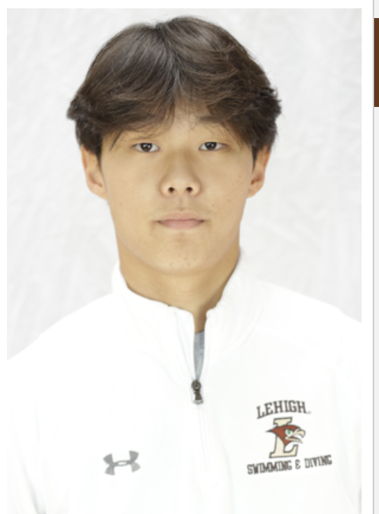

## About Me

Hello, I am a Finance Major at Lehigh, graduating May 2025. 
I am from Los Angeles, CA, and I was born in Korea.
My interests include sports, poker, and exercising.

<!-- Upload your own photo and change the path -->

  

---

## Portfolio

_**[Sentiment Analysis on 10-Ks using NLP to understand stock prices](report/report.md)**_

Used NLP to do a sentiment analysis on certain words by comparing to 2022 stock returns. 
Focused on the sentiments of three topics: Macro-economic, growth, and risk.

Below shows the scatter-plot of negative growth words relating to stock returns three days after the 10k release. 

---

_**[Prediction Contest](prediction_contest/modelcode.md)**_

The goal of this contest was to generate a model using that predicts the sale price of housing using various variables. The contest was then scored based on the r2 of the predicted sale price of the holdout set to the actual sale price. 

To begin, I started by testing several different ml models to determine which ones would be most optimal in creating a model for sale price. 

The tested modes were: 

Sklearn:
- Linear Regression
- Ridge
- RandomForestRegressor
- GradientBoostingRegressor
XGBOOST
- XGBRegressor

The below scatter plot shows the different types of models and how they performed on the train set. 

From this, XGBoost and the GradientBoostingRegressors showed the best results. XGBoost is a type of gradient boosting, and I decided to use XGBoost due to its advanced nature. 

Using XGBoost as my model, I was able to optomize certain hyperparameters, and achieved an r2 on the holdout set of ~0.88

__In the competetion among my classmates, I placed first!__

---

_**[Eventual team project](https://donbowen.github.io/teamproject/)**_

---

_**[Some personal project](/pdf/sample_presentation.pdf)**_

---

## Career Objectives

I am a driven Finance student with the aspirations of breaking into Investment Banking. 
I have experience creating financial models, and have a comprehensive understanding of DCFs and LBOs. 
My resume is attached below. 
[Resume](images/resume.pdf)

---

## Hobbies

Maybe include a little about these, especially if they are the kinds of things that work well in interviews.

---

Page template forked from <a href="https://github.com/evanca/quick-portfolio">evanca</a>

<!-- Remove above link if you don't want to attibute -->
