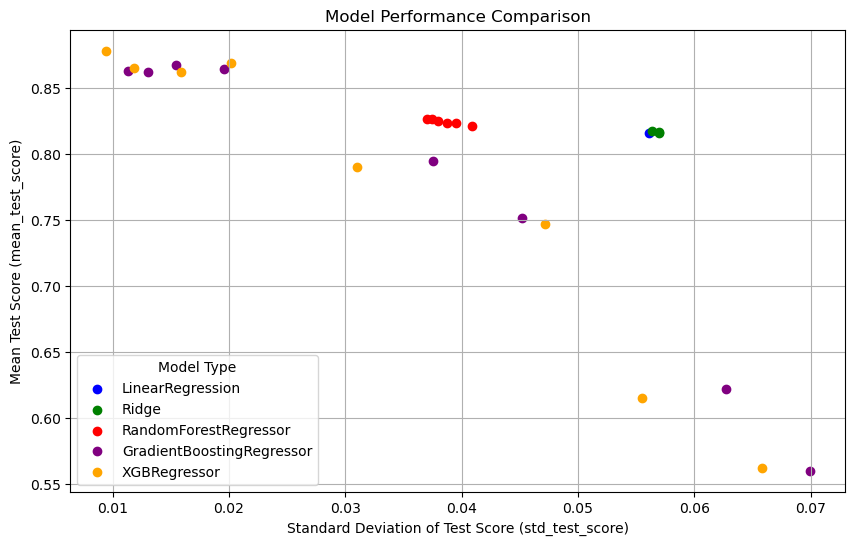

```python
import pandas as pd
import numpy as np
from sklearn import preprocessing
from sklearn.preprocessing import OneHotEncoder, StandardScaler
from sklearn.compose import ColumnTransformer, make_column_selector,make_column_transformer
from sklearn.pipeline import make_pipeline,Pipeline 
from sklearn.impute import SimpleImputer
from df_after_transform import df_after_transform
from sklearn.model_selection import KFold, cross_validate, GridSearchCV, cross_val_score,train_test_split
from sklearn.linear_model import Lasso,Ridge, LinearRegression
from sklearn.ensemble import RandomForestRegressor, GradientBoostingRegressor
from sklearn.feature_selection import SelectKBest, f_classif,f_regression
from sklearn.metrics import r2_score,make_scorer
import matplotlib.pyplot as plt
import seaborn as sns

import xgboost as xgb
from joblib import dump,load

from sklearn import set_config
set_config(display="diagram")  # display='text' is the default

pd.set_option('display.max_colwidth', 1000, 'display.max_rows', 50, 'display.max_columns', None) 
```

## Initial Setup


```python
# Load housing data, split X and y
housing = pd.read_csv('input_data2/housing_train.csv')
y_train = np.log(housing.v_SalePrice)
X_train = housing.drop('v_SalePrice',axis=1)
```


```python
# Preprocessing
#initialize pipes
numer_pipe = make_pipeline(SimpleImputer(strategy = 'mean'),
                        StandardScaler())
cat_pipe = make_pipeline(OneHotEncoder(drop = 'first'))


# find all numerics
num_pipe_features = X_train.select_dtypes(include=['number']).columns

#create preproc_pipe
preproc_pipe = make_column_transformer(
    (numer_pipe,num_pipe_features),
    (cat_pipe, ['v_Lot_Config']),
    remainder = 'drop',
)

```

## Initial optimization testing


```python
# create pipeline
first_pipeline = Pipeline([('columntransformer', preproc_pipe),
                ('regressor', LinearRegression())
                ])
first_pipeline
```


<style>#sk-container-id-1 {color: black;background-color: white;}#sk-container-id-1 pre{padding: 0;}#sk-container-id-1 div.sk-toggleable {background-color: white;}#sk-container-id-1 label.sk-toggleable__label {cursor: pointer;display: block;width: 100%;margin-bottom: 0;padding: 0.3em;box-sizing: border-box;text-align: center;}#sk-container-id-1 label.sk-toggleable__label-arrow:before {content: "▸";float: left;margin-right: 0.25em;color: #696969;}#sk-container-id-1 label.sk-toggleable__label-arrow:hover:before {color: black;}#sk-container-id-1 div.sk-estimator:hover label.sk-toggleable__label-arrow:before {color: black;}#sk-container-id-1 div.sk-toggleable__content {max-height: 0;max-width: 0;overflow: hidden;text-align: left;background-color: #f0f8ff;}#sk-container-id-1 div.sk-toggleable__content pre {margin: 0.2em;color: black;border-radius: 0.25em;background-color: #f0f8ff;}#sk-container-id-1 input.sk-toggleable__control:checked~div.sk-toggleable__content {max-height: 200px;max-width: 100%;overflow: auto;}#sk-container-id-1 input.sk-toggleable__control:checked~label.sk-toggleable__label-arrow:before {content: "▾";}#sk-container-id-1 div.sk-estimator input.sk-toggleable__control:checked~label.sk-toggleable__label {background-color: #d4ebff;}#sk-container-id-1 div.sk-label input.sk-toggleable__control:checked~label.sk-toggleable__label {background-color: #d4ebff;}#sk-container-id-1 input.sk-hidden--visually {border: 0;clip: rect(1px 1px 1px 1px);clip: rect(1px, 1px, 1px, 1px);height: 1px;margin: -1px;overflow: hidden;padding: 0;position: absolute;width: 1px;}#sk-container-id-1 div.sk-estimator {font-family: monospace;background-color: #f0f8ff;border: 1px dotted black;border-radius: 0.25em;box-sizing: border-box;margin-bottom: 0.5em;}#sk-container-id-1 div.sk-estimator:hover {background-color: #d4ebff;}#sk-container-id-1 div.sk-parallel-item::after {content: "";width: 100%;border-bottom: 1px solid gray;flex-grow: 1;}#sk-container-id-1 div.sk-label:hover label.sk-toggleable__label {background-color: #d4ebff;}#sk-container-id-1 div.sk-serial::before {content: "";position: absolute;border-left: 1px solid gray;box-sizing: border-box;top: 0;bottom: 0;left: 50%;z-index: 0;}#sk-container-id-1 div.sk-serial {display: flex;flex-direction: column;align-items: center;background-color: white;padding-right: 0.2em;padding-left: 0.2em;position: relative;}#sk-container-id-1 div.sk-item {position: relative;z-index: 1;}#sk-container-id-1 div.sk-parallel {display: flex;align-items: stretch;justify-content: center;background-color: white;position: relative;}#sk-container-id-1 div.sk-item::before, #sk-container-id-1 div.sk-parallel-item::before {content: "";position: absolute;border-left: 1px solid gray;box-sizing: border-box;top: 0;bottom: 0;left: 50%;z-index: -1;}#sk-container-id-1 div.sk-parallel-item {display: flex;flex-direction: column;z-index: 1;position: relative;background-color: white;}#sk-container-id-1 div.sk-parallel-item:first-child::after {align-self: flex-end;width: 50%;}#sk-container-id-1 div.sk-parallel-item:last-child::after {align-self: flex-start;width: 50%;}#sk-container-id-1 div.sk-parallel-item:only-child::after {width: 0;}#sk-container-id-1 div.sk-dashed-wrapped {border: 1px dashed gray;margin: 0 0.4em 0.5em 0.4em;box-sizing: border-box;padding-bottom: 0.4em;background-color: white;}#sk-container-id-1 div.sk-label label {font-family: monospace;font-weight: bold;display: inline-block;line-height: 1.2em;}#sk-container-id-1 div.sk-label-container {text-align: center;}#sk-container-id-1 div.sk-container {/* jupyter's `normalize.less` sets `[hidden] { display: none; }` but bootstrap.min.css set `[hidden] { display: none !important; }` so we also need the `!important` here to be able to override the default hidden behavior on the sphinx rendered scikit-learn.org. See: https://github.com/scikit-learn/scikit-learn/issues/21755 */display: inline-block !important;position: relative;}#sk-container-id-1 div.sk-text-repr-fallback {display: none;}</style><div id="sk-container-id-1" class="sk-top-container"><div class="sk-text-repr-fallback"><pre>Pipeline(steps=[(&#x27;columntransformer&#x27;,
                 ColumnTransformer(transformers=[(&#x27;pipeline-1&#x27;,
                                                  Pipeline(steps=[(&#x27;simpleimputer&#x27;,
                                                                   SimpleImputer()),
                                                                  (&#x27;standardscaler&#x27;,
                                                                   StandardScaler())]),
                                                  Index([&#x27;v_MS_SubClass&#x27;, &#x27;v_Lot_Frontage&#x27;, &#x27;v_Lot_Area&#x27;, &#x27;v_Overall_Qual&#x27;,
       &#x27;v_Overall_Cond&#x27;, &#x27;v_Year_Built&#x27;, &#x27;v_Year_Remod/Add&#x27;, &#x27;v_Mas_Vnr_Area&#x27;,
       &#x27;v_BsmtFin_SF_1&#x27;, &#x27;v_BsmtFin_SF_2&#x27;, &#x27;v_Bsmt...
       &#x27;v_Bedroom_AbvGr&#x27;, &#x27;v_Kitchen_AbvGr&#x27;, &#x27;v_TotRms_AbvGrd&#x27;, &#x27;v_Fireplaces&#x27;,
       &#x27;v_Garage_Yr_Blt&#x27;, &#x27;v_Garage_Cars&#x27;, &#x27;v_Garage_Area&#x27;, &#x27;v_Wood_Deck_SF&#x27;,
       &#x27;v_Open_Porch_SF&#x27;, &#x27;v_Enclosed_Porch&#x27;, &#x27;v_3Ssn_Porch&#x27;, &#x27;v_Screen_Porch&#x27;,
       &#x27;v_Pool_Area&#x27;, &#x27;v_Misc_Val&#x27;, &#x27;v_Mo_Sold&#x27;, &#x27;v_Yr_Sold&#x27;],
      dtype=&#x27;object&#x27;)),
                                                 (&#x27;pipeline-2&#x27;,
                                                  Pipeline(steps=[(&#x27;onehotencoder&#x27;,
                                                                   OneHotEncoder(drop=&#x27;first&#x27;))]),
                                                  [&#x27;v_Lot_Config&#x27;])])),
                (&#x27;regressor&#x27;, LinearRegression())])</pre><b>In a Jupyter environment, please rerun this cell to show the HTML representation or trust the notebook. <br />On GitHub, the HTML representation is unable to render, please try loading this page with nbviewer.org.</b></div><div class="sk-container" hidden><div class="sk-item sk-dashed-wrapped"><div class="sk-label-container"><div class="sk-label sk-toggleable"><input class="sk-toggleable__control sk-hidden--visually" id="sk-estimator-id-1" type="checkbox" ><label for="sk-estimator-id-1" class="sk-toggleable__label sk-toggleable__label-arrow">Pipeline</label><div class="sk-toggleable__content"><pre>Pipeline(steps=[(&#x27;columntransformer&#x27;,
                 ColumnTransformer(transformers=[(&#x27;pipeline-1&#x27;,
                                                  Pipeline(steps=[(&#x27;simpleimputer&#x27;,
                                                                   SimpleImputer()),
                                                                  (&#x27;standardscaler&#x27;,
                                                                   StandardScaler())]),
                                                  Index([&#x27;v_MS_SubClass&#x27;, &#x27;v_Lot_Frontage&#x27;, &#x27;v_Lot_Area&#x27;, &#x27;v_Overall_Qual&#x27;,
       &#x27;v_Overall_Cond&#x27;, &#x27;v_Year_Built&#x27;, &#x27;v_Year_Remod/Add&#x27;, &#x27;v_Mas_Vnr_Area&#x27;,
       &#x27;v_BsmtFin_SF_1&#x27;, &#x27;v_BsmtFin_SF_2&#x27;, &#x27;v_Bsmt...
       &#x27;v_Bedroom_AbvGr&#x27;, &#x27;v_Kitchen_AbvGr&#x27;, &#x27;v_TotRms_AbvGrd&#x27;, &#x27;v_Fireplaces&#x27;,
       &#x27;v_Garage_Yr_Blt&#x27;, &#x27;v_Garage_Cars&#x27;, &#x27;v_Garage_Area&#x27;, &#x27;v_Wood_Deck_SF&#x27;,
       &#x27;v_Open_Porch_SF&#x27;, &#x27;v_Enclosed_Porch&#x27;, &#x27;v_3Ssn_Porch&#x27;, &#x27;v_Screen_Porch&#x27;,
       &#x27;v_Pool_Area&#x27;, &#x27;v_Misc_Val&#x27;, &#x27;v_Mo_Sold&#x27;, &#x27;v_Yr_Sold&#x27;],
      dtype=&#x27;object&#x27;)),
                                                 (&#x27;pipeline-2&#x27;,
                                                  Pipeline(steps=[(&#x27;onehotencoder&#x27;,
                                                                   OneHotEncoder(drop=&#x27;first&#x27;))]),
                                                  [&#x27;v_Lot_Config&#x27;])])),
                (&#x27;regressor&#x27;, LinearRegression())])</pre></div></div></div><div class="sk-serial"><div class="sk-item sk-dashed-wrapped"><div class="sk-label-container"><div class="sk-label sk-toggleable"><input class="sk-toggleable__control sk-hidden--visually" id="sk-estimator-id-2" type="checkbox" ><label for="sk-estimator-id-2" class="sk-toggleable__label sk-toggleable__label-arrow">columntransformer: ColumnTransformer</label><div class="sk-toggleable__content"><pre>ColumnTransformer(transformers=[(&#x27;pipeline-1&#x27;,
                                 Pipeline(steps=[(&#x27;simpleimputer&#x27;,
                                                  SimpleImputer()),
                                                 (&#x27;standardscaler&#x27;,
                                                  StandardScaler())]),
                                 Index([&#x27;v_MS_SubClass&#x27;, &#x27;v_Lot_Frontage&#x27;, &#x27;v_Lot_Area&#x27;, &#x27;v_Overall_Qual&#x27;,
       &#x27;v_Overall_Cond&#x27;, &#x27;v_Year_Built&#x27;, &#x27;v_Year_Remod/Add&#x27;, &#x27;v_Mas_Vnr_Area&#x27;,
       &#x27;v_BsmtFin_SF_1&#x27;, &#x27;v_BsmtFin_SF_2&#x27;, &#x27;v_Bsmt_Unf_SF&#x27;, &#x27;v_Total_Bsmt_SF&#x27;,
       &#x27;v_1st_Flr...
       &#x27;v_Bedroom_AbvGr&#x27;, &#x27;v_Kitchen_AbvGr&#x27;, &#x27;v_TotRms_AbvGrd&#x27;, &#x27;v_Fireplaces&#x27;,
       &#x27;v_Garage_Yr_Blt&#x27;, &#x27;v_Garage_Cars&#x27;, &#x27;v_Garage_Area&#x27;, &#x27;v_Wood_Deck_SF&#x27;,
       &#x27;v_Open_Porch_SF&#x27;, &#x27;v_Enclosed_Porch&#x27;, &#x27;v_3Ssn_Porch&#x27;, &#x27;v_Screen_Porch&#x27;,
       &#x27;v_Pool_Area&#x27;, &#x27;v_Misc_Val&#x27;, &#x27;v_Mo_Sold&#x27;, &#x27;v_Yr_Sold&#x27;],
      dtype=&#x27;object&#x27;)),
                                (&#x27;pipeline-2&#x27;,
                                 Pipeline(steps=[(&#x27;onehotencoder&#x27;,
                                                  OneHotEncoder(drop=&#x27;first&#x27;))]),
                                 [&#x27;v_Lot_Config&#x27;])])</pre></div></div></div><div class="sk-parallel"><div class="sk-parallel-item"><div class="sk-item"><div class="sk-label-container"><div class="sk-label sk-toggleable"><input class="sk-toggleable__control sk-hidden--visually" id="sk-estimator-id-3" type="checkbox" ><label for="sk-estimator-id-3" class="sk-toggleable__label sk-toggleable__label-arrow">pipeline-1</label><div class="sk-toggleable__content"><pre>Index([&#x27;v_MS_SubClass&#x27;, &#x27;v_Lot_Frontage&#x27;, &#x27;v_Lot_Area&#x27;, &#x27;v_Overall_Qual&#x27;,
       &#x27;v_Overall_Cond&#x27;, &#x27;v_Year_Built&#x27;, &#x27;v_Year_Remod/Add&#x27;, &#x27;v_Mas_Vnr_Area&#x27;,
       &#x27;v_BsmtFin_SF_1&#x27;, &#x27;v_BsmtFin_SF_2&#x27;, &#x27;v_Bsmt_Unf_SF&#x27;, &#x27;v_Total_Bsmt_SF&#x27;,
       &#x27;v_1st_Flr_SF&#x27;, &#x27;v_2nd_Flr_SF&#x27;, &#x27;v_Low_Qual_Fin_SF&#x27;, &#x27;v_Gr_Liv_Area&#x27;,
       &#x27;v_Bsmt_Full_Bath&#x27;, &#x27;v_Bsmt_Half_Bath&#x27;, &#x27;v_Full_Bath&#x27;, &#x27;v_Half_Bath&#x27;,
       &#x27;v_Bedroom_AbvGr&#x27;, &#x27;v_Kitchen_AbvGr&#x27;, &#x27;v_TotRms_AbvGrd&#x27;, &#x27;v_Fireplaces&#x27;,
       &#x27;v_Garage_Yr_Blt&#x27;, &#x27;v_Garage_Cars&#x27;, &#x27;v_Garage_Area&#x27;, &#x27;v_Wood_Deck_SF&#x27;,
       &#x27;v_Open_Porch_SF&#x27;, &#x27;v_Enclosed_Porch&#x27;, &#x27;v_3Ssn_Porch&#x27;, &#x27;v_Screen_Porch&#x27;,
       &#x27;v_Pool_Area&#x27;, &#x27;v_Misc_Val&#x27;, &#x27;v_Mo_Sold&#x27;, &#x27;v_Yr_Sold&#x27;],
      dtype=&#x27;object&#x27;)</pre></div></div></div><div class="sk-serial"><div class="sk-item"><div class="sk-serial"><div class="sk-item"><div class="sk-estimator sk-toggleable"><input class="sk-toggleable__control sk-hidden--visually" id="sk-estimator-id-4" type="checkbox" ><label for="sk-estimator-id-4" class="sk-toggleable__label sk-toggleable__label-arrow">SimpleImputer</label><div class="sk-toggleable__content"><pre>SimpleImputer()</pre></div></div></div><div class="sk-item"><div class="sk-estimator sk-toggleable"><input class="sk-toggleable__control sk-hidden--visually" id="sk-estimator-id-5" type="checkbox" ><label for="sk-estimator-id-5" class="sk-toggleable__label sk-toggleable__label-arrow">StandardScaler</label><div class="sk-toggleable__content"><pre>StandardScaler()</pre></div></div></div></div></div></div></div></div><div class="sk-parallel-item"><div class="sk-item"><div class="sk-label-container"><div class="sk-label sk-toggleable"><input class="sk-toggleable__control sk-hidden--visually" id="sk-estimator-id-6" type="checkbox" ><label for="sk-estimator-id-6" class="sk-toggleable__label sk-toggleable__label-arrow">pipeline-2</label><div class="sk-toggleable__content"><pre>[&#x27;v_Lot_Config&#x27;]</pre></div></div></div><div class="sk-serial"><div class="sk-item"><div class="sk-serial"><div class="sk-item"><div class="sk-estimator sk-toggleable"><input class="sk-toggleable__control sk-hidden--visually" id="sk-estimator-id-7" type="checkbox" ><label for="sk-estimator-id-7" class="sk-toggleable__label sk-toggleable__label-arrow">OneHotEncoder</label><div class="sk-toggleable__content"><pre>OneHotEncoder(drop=&#x27;first&#x27;)</pre></div></div></div></div></div></div></div></div></div></div><div class="sk-item"><div class="sk-estimator sk-toggleable"><input class="sk-toggleable__control sk-hidden--visually" id="sk-estimator-id-8" type="checkbox" ><label for="sk-estimator-id-8" class="sk-toggleable__label sk-toggleable__label-arrow">LinearRegression</label><div class="sk-toggleable__content"><pre>LinearRegression()</pre></div></div></div></div></div></div></div>


Implemented 5 diff models:
LinearRegression, Ridge, RandomForest,GradientBoost,xgboost. 

The goal of this section is use broad parameters to determine which models work the best with our set to find our focus models. 


```python
param_grid = [
    {'regressor': [LinearRegression()]},
    {'regressor': [Ridge()], 'regressor__alpha': [0.1, 1.0, 10.0]},
    {'regressor': [RandomForestRegressor(random_state=42)], 
     'regressor__n_estimators': [100, 200], 'regressor__max_depth': [None, 10, 20]},
    {'regressor': [GradientBoostingRegressor(random_state=42)], 
     'regressor__n_estimators': [100, 200], 'regressor__learning_rate': [0.01, 0.1], 'regressor__max_depth': [3, 5]},
    {'regressor': [xgb.XGBRegressor(objective='reg:squarederror', random_state=42)],
     'regressor__n_estimators': [100, 200], 'regressor__learning_rate': [0.01, 0.1], 'regressor__max_depth': [3, 5]}
]

# Initialize GridSearchCV
grid_search = GridSearchCV(first_pipeline, param_grid, cv=5, scoring=make_scorer(r2_score))

# Fit GridSearchCV
results = grid_search.fit(X_train, y_train)

```


```python
# show all models
results_df = pd.DataFrame(results.cv_results_)
#display(results_df)
```


```python
# show top 5 models
sorted_df = results_df.sort_values(by='rank_test_score')
display(sorted_df.head(5))

```


<div>
<style scoped>
    .dataframe tbody tr th:only-of-type {
        vertical-align: middle;
    }

    .dataframe tbody tr th {
        vertical-align: top;
    }

    .dataframe thead th {
        text-align: right;
    }
</style>
<table border="1" class="dataframe">
  <thead>
    <tr style="text-align: right;">
      <th></th>
      <th>mean_fit_time</th>
      <th>std_fit_time</th>
      <th>mean_score_time</th>
      <th>std_score_time</th>
      <th>param_regressor</th>
      <th>param_regressor__alpha</th>
      <th>param_regressor__max_depth</th>
      <th>param_regressor__n_estimators</th>
      <th>param_regressor__learning_rate</th>
      <th>params</th>
      <th>split0_test_score</th>
      <th>split1_test_score</th>
      <th>split2_test_score</th>
      <th>split3_test_score</th>
      <th>split4_test_score</th>
      <th>mean_test_score</th>
      <th>std_test_score</th>
      <th>rank_test_score</th>
    </tr>
  </thead>
  <tbody>
    <tr>
      <th>23</th>
      <td>0.045453</td>
      <td>0.005345</td>
      <td>0.001336</td>
      <td>0.000039</td>
      <td>XGBRegressor(base_score=None, booster=None, callbacks=None,\n             colsample_bylevel=None, colsample_bynode=None,\n             colsample_bytree=None, device=None, early_stopping_rounds=None,\n             enable_categorical=False, eval_metric=None, feature_types=None,\n             gamma=None, grow_policy=None, importance_type=None,\n             interaction_constraints=None, learning_rate=0.1, max_bin=None,\n             max_cat_threshold=None, max_cat_to_onehot=None,\n             max_delta_step=None, max_depth=3, max_leaves=None,\n             min_child_weight=None, missing=nan, monotone_constraints=None,\n             multi_strategy=None, n_estimators=200, n_jobs=None,\n             num_parallel_tree=None, random_state=42, ...)</td>
      <td>NaN</td>
      <td>3</td>
      <td>200</td>
      <td>0.1</td>
      <td>{'regressor': XGBRegressor(base_score=None, booster=None, callbacks=None,
             colsample_bylevel=None, colsample_bynode=None,
             colsample_bytree=None, device=None, early_stopping_rounds=None,
             enable_categorical=False, eval_metric=None, feature_types=None,
             gamma=None, grow_policy=None, importance_type=None,
             interaction_constraints=None, learning_rate=0.1, max_bin=None,
             max_cat_threshold=None, max_cat_to_onehot=None,
             max_delta_step=None, max_depth=3, max_leaves=None,
             min_child_weight=None, missing=nan, monotone_constraints=None,
             multi_strategy=None, n_estimators=200, n_jobs=None,
             num_parallel_tree=None, random_state=42, ...), 'regressor__learning_rate': 0.1, 'regressor__max_depth': 3, 'regressor__n_estimators': 200}</td>
      <td>0.882344</td>
      <td>0.875975</td>
      <td>0.894589</td>
      <td>0.872338</td>
      <td>0.867376</td>
      <td>0.878525</td>
      <td>0.009399</td>
      <td>1</td>
    </tr>
    <tr>
      <th>22</th>
      <td>0.023851</td>
      <td>0.000609</td>
      <td>0.001291</td>
      <td>0.000080</td>
      <td>XGBRegressor(base_score=None, booster=None, callbacks=None,\n             colsample_bylevel=None, colsample_bynode=None,\n             colsample_bytree=None, device=None, early_stopping_rounds=None,\n             enable_categorical=False, eval_metric=None, feature_types=None,\n             gamma=None, grow_policy=None, importance_type=None,\n             interaction_constraints=None, learning_rate=0.1, max_bin=None,\n             max_cat_threshold=None, max_cat_to_onehot=None,\n             max_delta_step=None, max_depth=3, max_leaves=None,\n             min_child_weight=None, missing=nan, monotone_constraints=None,\n             multi_strategy=None, n_estimators=200, n_jobs=None,\n             num_parallel_tree=None, random_state=42, ...)</td>
      <td>NaN</td>
      <td>3</td>
      <td>100</td>
      <td>0.1</td>
      <td>{'regressor': XGBRegressor(base_score=None, booster=None, callbacks=None,
             colsample_bylevel=None, colsample_bynode=None,
             colsample_bytree=None, device=None, early_stopping_rounds=None,
             enable_categorical=False, eval_metric=None, feature_types=None,
             gamma=None, grow_policy=None, importance_type=None,
             interaction_constraints=None, learning_rate=0.1, max_bin=None,
             max_cat_threshold=None, max_cat_to_onehot=None,
             max_delta_step=None, max_depth=3, max_leaves=None,
             min_child_weight=None, missing=nan, monotone_constraints=None,
             multi_strategy=None, n_estimators=200, n_jobs=None,
             num_parallel_tree=None, random_state=42, ...), 'regressor__learning_rate': 0.1, 'regressor__max_depth': 3, 'regressor__n_estimators': 100}</td>
      <td>0.881188</td>
      <td>0.872635</td>
      <td>0.892755</td>
      <td>0.864018</td>
      <td>0.833179</td>
      <td>0.868755</td>
      <td>0.020168</td>
      <td>2</td>
    </tr>
    <tr>
      <th>15</th>
      <td>0.658460</td>
      <td>0.005539</td>
      <td>0.001886</td>
      <td>0.000297</td>
      <td>GradientBoostingRegressor(random_state=42)</td>
      <td>NaN</td>
      <td>3</td>
      <td>200</td>
      <td>0.1</td>
      <td>{'regressor': GradientBoostingRegressor(random_state=42), 'regressor__learning_rate': 0.1, 'regressor__max_depth': 3, 'regressor__n_estimators': 200}</td>
      <td>0.868932</td>
      <td>0.859619</td>
      <td>0.895496</td>
      <td>0.866676</td>
      <td>0.848962</td>
      <td>0.867937</td>
      <td>0.015436</td>
      <td>3</td>
    </tr>
    <tr>
      <th>25</th>
      <td>0.089054</td>
      <td>0.002955</td>
      <td>0.001906</td>
      <td>0.000588</td>
      <td>XGBRegressor(base_score=None, booster=None, callbacks=None,\n             colsample_bylevel=None, colsample_bynode=None,\n             colsample_bytree=None, device=None, early_stopping_rounds=None,\n             enable_categorical=False, eval_metric=None, feature_types=None,\n             gamma=None, grow_policy=None, importance_type=None,\n             interaction_constraints=None, learning_rate=0.1, max_bin=None,\n             max_cat_threshold=None, max_cat_to_onehot=None,\n             max_delta_step=None, max_depth=3, max_leaves=None,\n             min_child_weight=None, missing=nan, monotone_constraints=None,\n             multi_strategy=None, n_estimators=200, n_jobs=None,\n             num_parallel_tree=None, random_state=42, ...)</td>
      <td>NaN</td>
      <td>5</td>
      <td>200</td>
      <td>0.1</td>
      <td>{'regressor': XGBRegressor(base_score=None, booster=None, callbacks=None,
             colsample_bylevel=None, colsample_bynode=None,
             colsample_bytree=None, device=None, early_stopping_rounds=None,
             enable_categorical=False, eval_metric=None, feature_types=None,
             gamma=None, grow_policy=None, importance_type=None,
             interaction_constraints=None, learning_rate=0.1, max_bin=None,
             max_cat_threshold=None, max_cat_to_onehot=None,
             max_delta_step=None, max_depth=3, max_leaves=None,
             min_child_weight=None, missing=nan, monotone_constraints=None,
             multi_strategy=None, n_estimators=200, n_jobs=None,
             num_parallel_tree=None, random_state=42, ...), 'regressor__learning_rate': 0.1, 'regressor__max_depth': 5, 'regressor__n_estimators': 200}</td>
      <td>0.876344</td>
      <td>0.869796</td>
      <td>0.872133</td>
      <td>0.865312</td>
      <td>0.842679</td>
      <td>0.865253</td>
      <td>0.011837</td>
      <td>4</td>
    </tr>
    <tr>
      <th>14</th>
      <td>0.332188</td>
      <td>0.009319</td>
      <td>0.001486</td>
      <td>0.000160</td>
      <td>GradientBoostingRegressor(random_state=42)</td>
      <td>NaN</td>
      <td>3</td>
      <td>100</td>
      <td>0.1</td>
      <td>{'regressor': GradientBoostingRegressor(random_state=42), 'regressor__learning_rate': 0.1, 'regressor__max_depth': 3, 'regressor__n_estimators': 100}</td>
      <td>0.870595</td>
      <td>0.859571</td>
      <td>0.893509</td>
      <td>0.867244</td>
      <td>0.832723</td>
      <td>0.864728</td>
      <td>0.019596</td>
      <td>5</td>
    </tr>
  </tbody>
</table>
</div>


```python
def extract_model_name(params):
    return type(params['regressor']).__name__

# Apply the function to create a new column with the model name
results_df['model_name'] = results_df['params'].apply(extract_model_name)

# Map model names to colors
color_map = {
    'LinearRegression': 'blue',
    'Ridge': 'green',
    'RandomForestRegressor': 'red',
    'GradientBoostingRegressor': 'purple',
    'XGBRegressor': 'orange'
}

# Plotting
plt.figure(figsize=(10, 6))
for model_name, color in color_map.items():
    # Filter data for each model
    subset = results_df[results_df['model_name'] == model_name]
    
    # Plot each model data in the scatter plot
    plt.scatter(subset['std_test_score'], subset['mean_test_score'], color=color, label=model_name)

plt.xlabel('Standard Deviation of Test Score (std_test_score)')
plt.ylabel('Mean Test Score (mean_test_score)')
plt.title('Model Performance Comparison')
plt.legend(title='Model Type')
plt.grid(True)
plt.show()
```


    

    


The top models were either the GradientBoost or xgboost. xgboost is essentially a gradient boosting library, and this shows that using a gradient boost model is best in this data set. 

I will be using the xgboost model and tuning certian hyper parameters to optomize r2. 

It is important to recognize that the gradient boosting models boasted the best scores, as well as the lowest scores as well. This will show the importance of choosing valid hyperparamters. 

I chose the xgboost over the sklearn: gradientboost because xgboost has more features than gradient boost, 
and it handles larger datasets better. While our dataset is relatively small, Using xgboost will help translate this analysis to larger sets of data in the real world. 

## XGBOOST optimization


```python
xg_pipe = Pipeline([('preprocessor', preproc_pipe),
    ('regressor', xgb.XGBRegressor(objective='reg:squarederror'))])

```


```python
## from optomizing alpha only using the top parameters without alpha

parameters = {
    'regressor__n_estimators': [200, 300],
    'regressor__learning_rate': [0.01, 0.05, 0.1],
    'regressor__max_depth': [3, 5],
    'regressor__colsample_bytree': [0.6,0.7, 0.8],
    'regressor__subsample': [0.7, 0.8, 1.0],

    
}
grid_search = GridSearchCV(estimator = xg_pipe, param_grid=parameters, cv=5, scoring='r2')
results = grid_search.fit(X_train, y_train)

optimal_model = results.best_params_
# look online to understand more on xgboost parameters
# Fit the model
```


```python
## show table

results_df = pd.DataFrame(results.cv_results_)
display(results_df)
```


<div>
<style scoped>
    .dataframe tbody tr th:only-of-type {
        vertical-align: middle;
    }

    .dataframe tbody tr th {
        vertical-align: top;
    }

    .dataframe thead th {
        text-align: right;
    }
</style>
<table border="1" class="dataframe">
  <thead>
    <tr style="text-align: right;">
      <th></th>
      <th>mean_fit_time</th>
      <th>std_fit_time</th>
      <th>mean_score_time</th>
      <th>std_score_time</th>
      <th>param_regressor__colsample_bytree</th>
      <th>param_regressor__learning_rate</th>
      <th>param_regressor__max_depth</th>
      <th>param_regressor__n_estimators</th>
      <th>param_regressor__subsample</th>
      <th>params</th>
      <th>split0_test_score</th>
      <th>split1_test_score</th>
      <th>split2_test_score</th>
      <th>split3_test_score</th>
      <th>split4_test_score</th>
      <th>mean_test_score</th>
      <th>std_test_score</th>
      <th>rank_test_score</th>
    </tr>
  </thead>
  <tbody>
    <tr>
      <th>0</th>
      <td>0.054550</td>
      <td>0.013662</td>
      <td>0.001930</td>
      <td>0.000485</td>
      <td>0.6</td>
      <td>0.01</td>
      <td>3</td>
      <td>200</td>
      <td>0.7</td>
      <td>{'regressor__colsample_bytree': 0.6, 'regressor__learning_rate': 0.01, 'regressor__max_depth': 3, 'regressor__n_estimators': 200, 'regressor__subsample': 0.7}</td>
      <td>0.779967</td>
      <td>0.713743</td>
      <td>0.810654</td>
      <td>0.757609</td>
      <td>0.676959</td>
      <td>0.747786</td>
      <td>0.047455</td>
      <td>103</td>
    </tr>
    <tr>
      <th>1</th>
      <td>0.040769</td>
      <td>0.000955</td>
      <td>0.001365</td>
      <td>0.000043</td>
      <td>0.6</td>
      <td>0.01</td>
      <td>3</td>
      <td>200</td>
      <td>0.8</td>
      <td>{'regressor__colsample_bytree': 0.6, 'regressor__learning_rate': 0.01, 'regressor__max_depth': 3, 'regressor__n_estimators': 200, 'regressor__subsample': 0.8}</td>
      <td>0.779259</td>
      <td>0.710119</td>
      <td>0.812617</td>
      <td>0.757710</td>
      <td>0.682651</td>
      <td>0.748471</td>
      <td>0.046800</td>
      <td>100</td>
    </tr>
    <tr>
      <th>2</th>
      <td>0.042698</td>
      <td>0.003806</td>
      <td>0.001697</td>
      <td>0.000303</td>
      <td>0.6</td>
      <td>0.01</td>
      <td>3</td>
      <td>200</td>
      <td>1.0</td>
      <td>{'regressor__colsample_bytree': 0.6, 'regressor__learning_rate': 0.01, 'regressor__max_depth': 3, 'regressor__n_estimators': 200, 'regressor__subsample': 1.0}</td>
      <td>0.776877</td>
      <td>0.706808</td>
      <td>0.809206</td>
      <td>0.758100</td>
      <td>0.670700</td>
      <td>0.744338</td>
      <td>0.049572</td>
      <td>108</td>
    </tr>
    <tr>
      <th>3</th>
      <td>0.060063</td>
      <td>0.004481</td>
      <td>0.009898</td>
      <td>0.016597</td>
      <td>0.6</td>
      <td>0.01</td>
      <td>3</td>
      <td>300</td>
      <td>0.7</td>
      <td>{'regressor__colsample_bytree': 0.6, 'regressor__learning_rate': 0.01, 'regressor__max_depth': 3, 'regressor__n_estimators': 300, 'regressor__subsample': 0.7}</td>
      <td>0.834727</td>
      <td>0.801969</td>
      <td>0.861313</td>
      <td>0.819082</td>
      <td>0.744475</td>
      <td>0.812313</td>
      <td>0.039136</td>
      <td>83</td>
    </tr>
    <tr>
      <th>4</th>
      <td>0.057968</td>
      <td>0.001877</td>
      <td>0.001749</td>
      <td>0.000499</td>
      <td>0.6</td>
      <td>0.01</td>
      <td>3</td>
      <td>300</td>
      <td>0.8</td>
      <td>{'regressor__colsample_bytree': 0.6, 'regressor__learning_rate': 0.01, 'regressor__max_depth': 3, 'regressor__n_estimators': 300, 'regressor__subsample': 0.8}</td>
      <td>0.833448</td>
      <td>0.801364</td>
      <td>0.860943</td>
      <td>0.818924</td>
      <td>0.747170</td>
      <td>0.812370</td>
      <td>0.037997</td>
      <td>82</td>
    </tr>
    <tr>
      <th>...</th>
      <td>...</td>
      <td>...</td>
      <td>...</td>
      <td>...</td>
      <td>...</td>
      <td>...</td>
      <td>...</td>
      <td>...</td>
      <td>...</td>
      <td>...</td>
      <td>...</td>
      <td>...</td>
      <td>...</td>
      <td>...</td>
      <td>...</td>
      <td>...</td>
      <td>...</td>
      <td>...</td>
    </tr>
    <tr>
      <th>103</th>
      <td>0.089029</td>
      <td>0.002156</td>
      <td>0.001627</td>
      <td>0.000067</td>
      <td>0.8</td>
      <td>0.1</td>
      <td>5</td>
      <td>200</td>
      <td>0.8</td>
      <td>{'regressor__colsample_bytree': 0.8, 'regressor__learning_rate': 0.1, 'regressor__max_depth': 5, 'regressor__n_estimators': 200, 'regressor__subsample': 0.8}</td>
      <td>0.886978</td>
      <td>0.872967</td>
      <td>0.881387</td>
      <td>0.882692</td>
      <td>0.823042</td>
      <td>0.869413</td>
      <td>0.023627</td>
      <td>65</td>
    </tr>
    <tr>
      <th>104</th>
      <td>0.086027</td>
      <td>0.003787</td>
      <td>0.001674</td>
      <td>0.000151</td>
      <td>0.8</td>
      <td>0.1</td>
      <td>5</td>
      <td>200</td>
      <td>1.0</td>
      <td>{'regressor__colsample_bytree': 0.8, 'regressor__learning_rate': 0.1, 'regressor__max_depth': 5, 'regressor__n_estimators': 200, 'regressor__subsample': 1.0}</td>
      <td>0.875690</td>
      <td>0.869094</td>
      <td>0.876088</td>
      <td>0.883686</td>
      <td>0.836756</td>
      <td>0.868263</td>
      <td>0.016417</td>
      <td>68</td>
    </tr>
    <tr>
      <th>105</th>
      <td>0.129308</td>
      <td>0.001955</td>
      <td>0.001868</td>
      <td>0.000152</td>
      <td>0.8</td>
      <td>0.1</td>
      <td>5</td>
      <td>300</td>
      <td>0.7</td>
      <td>{'regressor__colsample_bytree': 0.8, 'regressor__learning_rate': 0.1, 'regressor__max_depth': 5, 'regressor__n_estimators': 300, 'regressor__subsample': 0.7}</td>
      <td>0.875555</td>
      <td>0.859618</td>
      <td>0.881559</td>
      <td>0.879784</td>
      <td>0.839578</td>
      <td>0.867219</td>
      <td>0.015842</td>
      <td>72</td>
    </tr>
    <tr>
      <th>106</th>
      <td>0.136016</td>
      <td>0.005202</td>
      <td>0.001922</td>
      <td>0.000239</td>
      <td>0.8</td>
      <td>0.1</td>
      <td>5</td>
      <td>300</td>
      <td>0.8</td>
      <td>{'regressor__colsample_bytree': 0.8, 'regressor__learning_rate': 0.1, 'regressor__max_depth': 5, 'regressor__n_estimators': 300, 'regressor__subsample': 0.8}</td>
      <td>0.886461</td>
      <td>0.872335</td>
      <td>0.880836</td>
      <td>0.882212</td>
      <td>0.822290</td>
      <td>0.868827</td>
      <td>0.023716</td>
      <td>66</td>
    </tr>
    <tr>
      <th>107</th>
      <td>0.131447</td>
      <td>0.001624</td>
      <td>0.001851</td>
      <td>0.000132</td>
      <td>0.8</td>
      <td>0.1</td>
      <td>5</td>
      <td>300</td>
      <td>1.0</td>
      <td>{'regressor__colsample_bytree': 0.8, 'regressor__learning_rate': 0.1, 'regressor__max_depth': 5, 'regressor__n_estimators': 300, 'regressor__subsample': 1.0}</td>
      <td>0.875578</td>
      <td>0.867308</td>
      <td>0.876286</td>
      <td>0.883074</td>
      <td>0.838107</td>
      <td>0.868071</td>
      <td>0.015795</td>
      <td>70</td>
    </tr>
  </tbody>
</table>
<p>108 rows × 18 columns</p>
</div>


```python
# show top 5 models
sorted_df = results_df.sort_values(by='rank_test_score')
display(sorted_df.head(10))
```


<div>
<style scoped>
    .dataframe tbody tr th:only-of-type {
        vertical-align: middle;
    }

    .dataframe tbody tr th {
        vertical-align: top;
    }

    .dataframe thead th {
        text-align: right;
    }
</style>
<table border="1" class="dataframe">
  <thead>
    <tr style="text-align: right;">
      <th></th>
      <th>mean_fit_time</th>
      <th>std_fit_time</th>
      <th>mean_score_time</th>
      <th>std_score_time</th>
      <th>param_regressor__colsample_bytree</th>
      <th>param_regressor__learning_rate</th>
      <th>param_regressor__max_depth</th>
      <th>param_regressor__n_estimators</th>
      <th>param_regressor__subsample</th>
      <th>params</th>
      <th>split0_test_score</th>
      <th>split1_test_score</th>
      <th>split2_test_score</th>
      <th>split3_test_score</th>
      <th>split4_test_score</th>
      <th>mean_test_score</th>
      <th>std_test_score</th>
      <th>rank_test_score</th>
    </tr>
  </thead>
  <tbody>
    <tr>
      <th>98</th>
      <td>0.043464</td>
      <td>0.001619</td>
      <td>0.001502</td>
      <td>0.000199</td>
      <td>0.8</td>
      <td>0.1</td>
      <td>3</td>
      <td>200</td>
      <td>1.0</td>
      <td>{'regressor__colsample_bytree': 0.8, 'regressor__learning_rate': 0.1, 'regressor__max_depth': 3, 'regressor__n_estimators': 200, 'regressor__subsample': 1.0}</td>
      <td>0.885084</td>
      <td>0.875006</td>
      <td>0.896909</td>
      <td>0.875615</td>
      <td>0.872360</td>
      <td>0.880995</td>
      <td>0.009048</td>
      <td>1</td>
    </tr>
    <tr>
      <th>101</th>
      <td>0.063272</td>
      <td>0.002898</td>
      <td>0.001675</td>
      <td>0.000231</td>
      <td>0.8</td>
      <td>0.1</td>
      <td>3</td>
      <td>300</td>
      <td>1.0</td>
      <td>{'regressor__colsample_bytree': 0.8, 'regressor__learning_rate': 0.1, 'regressor__max_depth': 3, 'regressor__n_estimators': 300, 'regressor__subsample': 1.0}</td>
      <td>0.884181</td>
      <td>0.872842</td>
      <td>0.898161</td>
      <td>0.876703</td>
      <td>0.872757</td>
      <td>0.880929</td>
      <td>0.009566</td>
      <td>2</td>
    </tr>
    <tr>
      <th>26</th>
      <td>0.038614</td>
      <td>0.001403</td>
      <td>0.001400</td>
      <td>0.000111</td>
      <td>0.6</td>
      <td>0.1</td>
      <td>3</td>
      <td>200</td>
      <td>1.0</td>
      <td>{'regressor__colsample_bytree': 0.6, 'regressor__learning_rate': 0.1, 'regressor__max_depth': 3, 'regressor__n_estimators': 200, 'regressor__subsample': 1.0}</td>
      <td>0.886796</td>
      <td>0.870677</td>
      <td>0.897267</td>
      <td>0.877205</td>
      <td>0.872300</td>
      <td>0.880849</td>
      <td>0.009947</td>
      <td>3</td>
    </tr>
    <tr>
      <th>62</th>
      <td>0.043111</td>
      <td>0.005271</td>
      <td>0.001626</td>
      <td>0.000162</td>
      <td>0.7</td>
      <td>0.1</td>
      <td>3</td>
      <td>200</td>
      <td>1.0</td>
      <td>{'regressor__colsample_bytree': 0.7, 'regressor__learning_rate': 0.1, 'regressor__max_depth': 3, 'regressor__n_estimators': 200, 'regressor__subsample': 1.0}</td>
      <td>0.885598</td>
      <td>0.870062</td>
      <td>0.894292</td>
      <td>0.873079</td>
      <td>0.879083</td>
      <td>0.880423</td>
      <td>0.008743</td>
      <td>4</td>
    </tr>
    <tr>
      <th>65</th>
      <td>0.059456</td>
      <td>0.003413</td>
      <td>0.001521</td>
      <td>0.000083</td>
      <td>0.7</td>
      <td>0.1</td>
      <td>3</td>
      <td>300</td>
      <td>1.0</td>
      <td>{'regressor__colsample_bytree': 0.7, 'regressor__learning_rate': 0.1, 'regressor__max_depth': 3, 'regressor__n_estimators': 300, 'regressor__subsample': 1.0}</td>
      <td>0.883950</td>
      <td>0.869399</td>
      <td>0.894431</td>
      <td>0.874392</td>
      <td>0.878809</td>
      <td>0.880196</td>
      <td>0.008590</td>
      <td>5</td>
    </tr>
    <tr>
      <th>53</th>
      <td>0.058516</td>
      <td>0.001407</td>
      <td>0.001693</td>
      <td>0.000057</td>
      <td>0.7</td>
      <td>0.05</td>
      <td>3</td>
      <td>300</td>
      <td>1.0</td>
      <td>{'regressor__colsample_bytree': 0.7, 'regressor__learning_rate': 0.05, 'regressor__max_depth': 3, 'regressor__n_estimators': 300, 'regressor__subsample': 1.0}</td>
      <td>0.885515</td>
      <td>0.873327</td>
      <td>0.900885</td>
      <td>0.875316</td>
      <td>0.864602</td>
      <td>0.879929</td>
      <td>0.012411</td>
      <td>6</td>
    </tr>
    <tr>
      <th>29</th>
      <td>0.053351</td>
      <td>0.001488</td>
      <td>0.001417</td>
      <td>0.000079</td>
      <td>0.6</td>
      <td>0.1</td>
      <td>3</td>
      <td>300</td>
      <td>1.0</td>
      <td>{'regressor__colsample_bytree': 0.6, 'regressor__learning_rate': 0.1, 'regressor__max_depth': 3, 'regressor__n_estimators': 300, 'regressor__subsample': 1.0}</td>
      <td>0.887242</td>
      <td>0.868844</td>
      <td>0.898061</td>
      <td>0.877307</td>
      <td>0.866637</td>
      <td>0.879618</td>
      <td>0.011732</td>
      <td>7</td>
    </tr>
    <tr>
      <th>61</th>
      <td>0.045179</td>
      <td>0.008651</td>
      <td>0.001591</td>
      <td>0.000196</td>
      <td>0.7</td>
      <td>0.1</td>
      <td>3</td>
      <td>200</td>
      <td>0.8</td>
      <td>{'regressor__colsample_bytree': 0.7, 'regressor__learning_rate': 0.1, 'regressor__max_depth': 3, 'regressor__n_estimators': 200, 'regressor__subsample': 0.8}</td>
      <td>0.888671</td>
      <td>0.867338</td>
      <td>0.897604</td>
      <td>0.881924</td>
      <td>0.858016</td>
      <td>0.878710</td>
      <td>0.014311</td>
      <td>8</td>
    </tr>
    <tr>
      <th>16</th>
      <td>0.056086</td>
      <td>0.002034</td>
      <td>0.001562</td>
      <td>0.000351</td>
      <td>0.6</td>
      <td>0.05</td>
      <td>3</td>
      <td>300</td>
      <td>0.8</td>
      <td>{'regressor__colsample_bytree': 0.6, 'regressor__learning_rate': 0.05, 'regressor__max_depth': 3, 'regressor__n_estimators': 300, 'regressor__subsample': 0.8}</td>
      <td>0.887769</td>
      <td>0.874624</td>
      <td>0.898460</td>
      <td>0.879387</td>
      <td>0.853049</td>
      <td>0.878658</td>
      <td>0.015151</td>
      <td>9</td>
    </tr>
    <tr>
      <th>64</th>
      <td>0.058431</td>
      <td>0.001866</td>
      <td>0.001694</td>
      <td>0.000339</td>
      <td>0.7</td>
      <td>0.1</td>
      <td>3</td>
      <td>300</td>
      <td>0.8</td>
      <td>{'regressor__colsample_bytree': 0.7, 'regressor__learning_rate': 0.1, 'regressor__max_depth': 3, 'regressor__n_estimators': 300, 'regressor__subsample': 0.8}</td>
      <td>0.888867</td>
      <td>0.862250</td>
      <td>0.898024</td>
      <td>0.882629</td>
      <td>0.860507</td>
      <td>0.878455</td>
      <td>0.014788</td>
      <td>10</td>
    </tr>
  </tbody>
</table>
</div>


```python
optimal_model = results.best_estimator_
```

## Testing the final model


```python
# input holdout data, initialize x and y variables
X_test= pd.read_csv('input_data2/housing_holdout.csv')

# run optimal params:

y_pred = optimal_model.predict(X_test)

results_df = pd.DataFrame({
    'parcel': X_test['parcel'],
    'predicted log(SalePrice)': y_pred
})
results_df.to_csv('submission/MY_PREDICTIONS.csv', index=False)
```


```python

```
