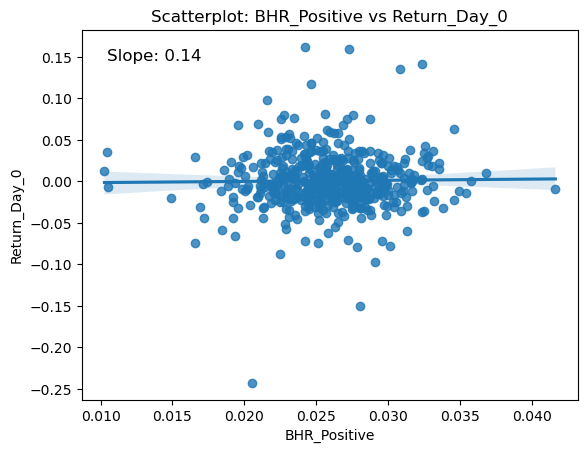
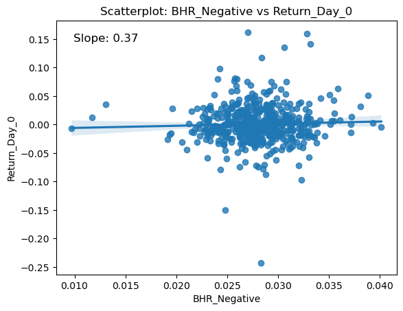

```python
import pandas as pd
import numpy as np
import matplotlib.pyplot as plt
import seaborn as sns
from scipy.stats import linregress
```

# Summary

the Main question being asked is: how does sentiment in a company's 10-K affect their stock prices? this question is answered through sentiment analysis of their 10ks, the first is through analyzing the 10k forms for positive/negative words, and the second is through analyzing specific contextual topics, and seeing if any of these topics are met with positive or negative sentiments. 

These sentiments are made into variables by noting the frequency of these words, and it is compared against stock returns on dates following the 10-k filing.

__Important issue with code__

Please read the README

# Data Section

__What is the Sample??__

The sample is the 10ks of SP500 firms, as well as the 2022 returns of the SP500 firms

## How are Return variables created? 


First, it is important to find the relevant date to find these returns. This date was the filing date of the 10k. To do this, I used basic webscraping using Beautiful soup in their 10k webpage to find the date. 


Next, we used the CRSP dataset which is a table with three columns: the Firm(as ticker), date, and the return. 

Using this I decided to loop through each firm, and find their filing date and their ticker as this was how we would search for the return in the CRSP dataset. I used df.loc, and saved the filing date and ticker to find the return.

I decided to find the index value where the Filing date was matched for the respective ticker. I used: 
``` 
 index_value_array = crsp[(crsp['date'] == filing_date) & (crsp['ticker'] == ticker)]
    if index_value_array.size != 0:
        index_value = index_value_array.index[0]
```
to find the index value. the if statement was used to pass over missing values.
To find the day of return I used:
```dayof_ret = crsp.loc[index_value,'ret']```

for the mutiple day returns, I used :
```
three_day = crsp.loc[index_value:index_value+2,'ret']
    sum_three = sum(three_day)
```

Then, this was added to a ret df: 
```
ret_df = ret_df._append({'CIK':cik, 'Return_Day_0': dayof_ret, 'Return_Day_0-2': sum_three, 'Return_Day_3-10': sum_seven},ignore_index= True)
```

## How are sentiment variables created?

___How are the sentiment variables created?___

__Dictionary Sentiment__

For the LM and BHR dictionaries, I first loaded the two dictionaries.
the LM dictionary was a csv, so I used pd.read_csv, and added them their own lists by:

```
lm_positive = lm_df[lm_df['Positive'] == 2009]['Word'].tolist()
lm_negative = lm_df[lm_df['Negative'] == 2009]['Word'].tolist()
```
It was also important that these words were lower case, so it could be matched to the 10ks. 
``` lm_positive = [word.lower() for word in lm_positive]```

Next, the BHR dictionary was a file, it was opned and made it to a list by:
```
with open("inputs/ML_positive_unigram.txt", "r", encoding = 'utf-8') as file:
    text = file.read()
    words = text.split()
    bhr_positive.extend(words)
bhr_positive

```
__Contextual Senitment__

Now when looking at the contextual sentiment variables, I had two topics, a list looking at macro economic conditions, and a list looking towards sales growth in a company.
these lists were created by initializing a list and inputting strings inside.

Next I decided to make a topic covering risk using words from Kathleen Hanleys paper. I copied the contents of table 5 from her paper and split the words to create a list for risk: 
```
words = text.split()

for x in range(len(words)):
    if x % 5 == 1:
       risk_list.append(words[x].lower() + " "+ words[x+1].lower())
```


___How are these variables analyzed?___

__Dictionary Sentiment__

To analyze the sentiment covering the positive and negative words in the BHR and LM dictionaries, I created a function: pos_neg_sent(cleaned_html). 
this function would take in the html file and output the ratio of the found positive or negative words to the total number of words in the 10k. 

The steps to find the matches were to create a regex for the list of words, then used re.findall to find the matches in the html.
This was the code used to find the matches of dictionary positive or negative word in the 10k:
```
bhr_pos_exact_regex = rf"\b({'|'.join(map(re.escape, bhr_positive))})\b"
bhr_pos_match = len(re.findall(bhr_pos_exact_regex,text))
```
This number was divided by the total count of words in the 10k, and became a return variable for the function. 

__Contextual Sentiment__

Next, when looking at the contextual sentiments, another funciton was created: contextual_pos_neg_sent(cleaned_html)

the idea behind this was to find the contextual words, then see if there were any positive or negative words from the BHR dictionary close to the word. 

first, it was important to create the regex for the positive and negative words:
```
  bhr_pos_regex = "("+ "|".join(bhr_positive) +")"
  bhr_neg_regex = "("+ "|".join(bhr_negative) +")"
```

then, each contextual sentiment list was made into a regex form, and I used the NEAR_regex fucntion to find how many were close to the search words, using my macro list as an example:

```
    macro_regex = "("+ "|".join(macro_list) +")"
    macro_pos_near = len(re.findall(NEAR_regex( [macro_regex,bhr_pos_regex],partial = True ), text)) / total_words_count

    macro_neg_near = len(re.findall(NEAR_regex( [macro_regex,bhr_neg_regex], partial = True ), text)) / total_words_count
```
It was important to make partial = True, as some words in the list can be expanded, for example, interest rate could be interest rates. 

these then became return variables for my function

___Why did you choose your contextual Sentiment topics?___

I chose the macro topic because it seemed very broad, and I wanted to see if companies were talking about their thoughts on the macroeconomic landscape in a certain way it would have an effect on their stock price. 

I then chose the topic of sales growth becuase I wanted to see if companies were talking about their growth in certain way, if the markets would react in the same way as their thoughts. 

Then, I chose the risk topic from Kathleen Hanleys paper because she had done extensive research on her list, and I wanted to see if her list of words would show any impact on our sample of the sp500. 

__Contextual Topic smell test__

There werent many issues with the contextual topics, the only thing is that there arent very many instances of the contextual topics, many of the contextual sentiment variables were less than 0.001. 
Because these numbers are so little, the tiniest amount of variance in these variables compared to the stock price can show correlations that are much more exagerated. 

Also, the interpretation of these variables might not be correct. The word "increase" is a positive word in the BHR dictionary. However, a word like "interest rate" paired with "increase" is not neccesarilly a good thing. On the contrary, a word like "growth" paired with "increase" is a good thing. 

## Final analysis Sample

__Show and discuss summary stats of your final analysis sample__


```python
# import analysis sample

analysis_sample = pd.read_csv('output/analysis_sample.csv')
analysis_sample
```


<div>
<style scoped>
    .dataframe tbody tr th:only-of-type {
        vertical-align: middle;
    }

    .dataframe tbody tr th {
        vertical-align: top;
    }

    .dataframe thead th {
        text-align: right;
    }
</style>
<table border="1" class="dataframe">
  <thead>
    <tr style="text-align: right;">
      <th></th>
      <th>CIK</th>
      <th>BHR_Positive</th>
      <th>BHR_Negative</th>
      <th>LM_Positive</th>
      <th>LM_Negative</th>
      <th>Macro_Positive</th>
      <th>Macro_Negative</th>
      <th>Growth_Positive</th>
      <th>Growth_Negative</th>
      <th>Risk_Positive</th>
      <th>Risk_Negative</th>
      <th>Return_Day_0</th>
      <th>Return_Day_0-2</th>
      <th>Return_Day_3-10</th>
    </tr>
  </thead>
  <tbody>
    <tr>
      <th>0</th>
      <td>851968.0</td>
      <td>0.024441</td>
      <td>0.027862</td>
      <td>0.005825</td>
      <td>0.019632</td>
      <td>0.000521</td>
      <td>0.000992</td>
      <td>0.001760</td>
      <td>0.001611</td>
      <td>0.000892</td>
      <td>0.001215</td>
      <td>-0.007862</td>
      <td>0.031367</td>
      <td>-0.042790</td>
    </tr>
    <tr>
      <th>1</th>
      <td>47111.0</td>
      <td>0.032343</td>
      <td>0.030271</td>
      <td>0.005742</td>
      <td>0.010755</td>
      <td>0.000474</td>
      <td>0.000651</td>
      <td>0.002052</td>
      <td>0.001894</td>
      <td>0.000947</td>
      <td>0.000888</td>
      <td>0.002772</td>
      <td>0.002681</td>
      <td>0.053615</td>
    </tr>
    <tr>
      <th>2</th>
      <td>79879.0</td>
      <td>0.029260</td>
      <td>0.029556</td>
      <td>0.004983</td>
      <td>0.017929</td>
      <td>0.001183</td>
      <td>0.001069</td>
      <td>0.002685</td>
      <td>0.002093</td>
      <td>0.000933</td>
      <td>0.000728</td>
      <td>-0.014684</td>
      <td>-0.030573</td>
      <td>-0.163290</td>
    </tr>
    <tr>
      <th>3</th>
      <td>1032208.0</td>
      <td>0.022571</td>
      <td>0.030765</td>
      <td>0.003304</td>
      <td>0.016288</td>
      <td>0.000411</td>
      <td>0.000519</td>
      <td>0.001111</td>
      <td>0.001594</td>
      <td>0.000786</td>
      <td>0.000671</td>
      <td>0.053714</td>
      <td>0.079956</td>
      <td>0.061065</td>
    </tr>
    <tr>
      <th>4</th>
      <td>1038357.0</td>
      <td>0.019227</td>
      <td>0.026801</td>
      <td>0.004248</td>
      <td>0.017174</td>
      <td>0.000039</td>
      <td>0.000065</td>
      <td>0.000689</td>
      <td>0.001000</td>
      <td>0.000922</td>
      <td>0.001312</td>
      <td>-0.043620</td>
      <td>-0.031549</td>
      <td>0.067805</td>
    </tr>
    <tr>
      <th>...</th>
      <td>...</td>
      <td>...</td>
      <td>...</td>
      <td>...</td>
      <td>...</td>
      <td>...</td>
      <td>...</td>
      <td>...</td>
      <td>...</td>
      <td>...</td>
      <td>...</td>
      <td>...</td>
      <td>...</td>
      <td>...</td>
    </tr>
    <tr>
      <th>493</th>
      <td>24545.0</td>
      <td>0.026551</td>
      <td>0.034172</td>
      <td>0.004889</td>
      <td>0.019183</td>
      <td>0.000994</td>
      <td>0.001066</td>
      <td>0.001426</td>
      <td>0.001546</td>
      <td>0.001006</td>
      <td>0.001186</td>
      <td>0.046745</td>
      <td>0.072810</td>
      <td>0.029265</td>
    </tr>
    <tr>
      <th>494</th>
      <td>1116132.0</td>
      <td>0.029097</td>
      <td>0.032049</td>
      <td>0.005956</td>
      <td>0.016183</td>
      <td>0.000474</td>
      <td>0.000949</td>
      <td>0.002091</td>
      <td>0.002108</td>
      <td>0.001037</td>
      <td>0.001511</td>
      <td>0.012396</td>
      <td>-0.045857</td>
      <td>-0.012561</td>
    </tr>
    <tr>
      <th>495</th>
      <td>899051.0</td>
      <td>0.023295</td>
      <td>0.029168</td>
      <td>0.005147</td>
      <td>0.027540</td>
      <td>0.000353</td>
      <td>0.000667</td>
      <td>0.002098</td>
      <td>0.002343</td>
      <td>0.000520</td>
      <td>0.000627</td>
      <td>0.026500</td>
      <td>0.005676</td>
      <td>0.024089</td>
    </tr>
    <tr>
      <th>496</th>
      <td>815097.0</td>
      <td>0.018462</td>
      <td>0.023049</td>
      <td>0.008634</td>
      <td>0.014145</td>
      <td>0.000308</td>
      <td>0.000347</td>
      <td>0.000655</td>
      <td>0.000771</td>
      <td>0.000540</td>
      <td>0.000617</td>
      <td>-0.058157</td>
      <td>-0.021202</td>
      <td>0.160954</td>
    </tr>
    <tr>
      <th>497</th>
      <td>1341439.0</td>
      <td>0.025740</td>
      <td>0.027578</td>
      <td>0.005500</td>
      <td>0.015527</td>
      <td>0.000587</td>
      <td>0.000912</td>
      <td>0.001622</td>
      <td>0.002117</td>
      <td>0.000803</td>
      <td>0.000726</td>
      <td>-0.000591</td>
      <td>-0.001049</td>
      <td>0.059556</td>
    </tr>
  </tbody>
</table>
<p>498 rows × 14 columns</p>
</div>


```python
## summary stats
print(analysis_sample.describe())
```

                    CIK  BHR_Positive  BHR_Negative  LM_Positive  LM_Negative  \
    count  4.980000e+02    498.000000    498.000000   498.000000   498.000000   
    mean   7.851046e+05      0.025896      0.027998     0.005259     0.017151   
    std    5.501943e+05      0.003777      0.003526     0.001357     0.003862   
    min    1.800000e+03      0.010268      0.009723     0.001332     0.007466   
    25%    9.727650e+04      0.023535      0.025986     0.004370     0.014384   
    50%    8.825095e+05      0.025884      0.027874     0.005158     0.016897   
    75%    1.136007e+06      0.028057      0.030009     0.005969     0.019212   
    max    1.868275e+06      0.041647      0.040156     0.011212     0.032295   
    
           Macro_Positive  Macro_Negative  Growth_Positive  Growth_Negative  \
    count      498.000000      498.000000       498.000000       498.000000   
    mean         0.000401        0.000615         0.001597         0.001687   
    std          0.000277        0.000356         0.000691         0.000643   
    min          0.000030        0.000046         0.000222         0.000174   
    25%          0.000206        0.000330         0.001086         0.001245   
    50%          0.000344        0.000566         0.001478         0.001624   
    75%          0.000506        0.000793         0.001996         0.002092   
    max          0.001916        0.002065         0.004632         0.004184   
    
           Risk_Positive  Risk_Negative  Return_Day_0  Return_Day_0-2  \
    count     498.000000     498.000000    498.000000      498.000000   
    mean        0.000775       0.001023      0.000712        0.004073   
    std         0.000280       0.000413      0.033989        0.052194   
    min         0.000127       0.000111     -0.242779       -0.439716   
    25%         0.000580       0.000704     -0.016603       -0.025219   
    50%         0.000738       0.000940     -0.001542        0.001479   
    75%         0.000913       0.001290      0.016932        0.029684   
    max         0.002273       0.002641      0.162141        0.219134   
    
           Return_Day_3-10  
    count       498.000000  
    mean         -0.007935  
    std           0.064548  
    min          -0.319105  
    25%          -0.044749  
    50%          -0.007380  
    75%           0.030081  
    max           0.305494  


From the analysis sample summary statistics we can conclude 2 things.

1. There is not much change in the returns after a 10k. As we can see, the max returns of any of the return variables was 0.3. This can be explained by the fact that the contents of 10k reports are fairly expected by the market, and stock prices are more likely to change upon real-time reports on large changes in the firm. 10-k reports simply state the past, and stock prices are more forward looking.
2. There arent many instances of the contextual sentiments: mean is around < 0.001, and the maxes are all around 0.002 and 0.005. This means there is not enough evidence of the contextual sentiments, and we must be careful in making decsions around these sentiments. 

# Results

## Correlation table


```python
## Correlation table:

corr_matrix = analysis_sample.corr()
sent_ret_corr = corr_matrix[['Return_Day_0','Return_Day_0-2','Return_Day_3-10']]
sent_ret_corr

## filter
rows_to_remove = ['CIK','Return_Day_0','Return_Day_0-2','Return_Day_3-10']
sent_ret_corr= sent_ret_corr[~sent_ret_corr.index.isin(rows_to_remove)]

sent_ret_corr

```


<div>
<style scoped>
    .dataframe tbody tr th:only-of-type {
        vertical-align: middle;
    }

    .dataframe tbody tr th {
        vertical-align: top;
    }

    .dataframe thead th {
        text-align: right;
    }
</style>
<table border="1" class="dataframe">
  <thead>
    <tr style="text-align: right;">
      <th></th>
      <th>Return_Day_0</th>
      <th>Return_Day_0-2</th>
      <th>Return_Day_3-10</th>
    </tr>
  </thead>
  <tbody>
    <tr>
      <th>BHR_Positive</th>
      <td>0.015414</td>
      <td>0.038084</td>
      <td>-0.040830</td>
    </tr>
    <tr>
      <th>BHR_Negative</th>
      <td>0.038712</td>
      <td>0.069001</td>
      <td>0.047730</td>
    </tr>
    <tr>
      <th>LM_Positive</th>
      <td>-0.103379</td>
      <td>-0.096236</td>
      <td>-0.032736</td>
    </tr>
    <tr>
      <th>LM_Negative</th>
      <td>-0.026249</td>
      <td>-0.018889</td>
      <td>-0.129414</td>
    </tr>
    <tr>
      <th>Macro_Positive</th>
      <td>-0.029471</td>
      <td>-0.070967</td>
      <td>-0.059321</td>
    </tr>
    <tr>
      <th>Macro_Negative</th>
      <td>0.001909</td>
      <td>-0.061489</td>
      <td>-0.103533</td>
    </tr>
    <tr>
      <th>Growth_Positive</th>
      <td>-0.059640</td>
      <td>-0.085038</td>
      <td>-0.099662</td>
    </tr>
    <tr>
      <th>Growth_Negative</th>
      <td>-0.016741</td>
      <td>-0.091785</td>
      <td>-0.043385</td>
    </tr>
    <tr>
      <th>Risk_Positive</th>
      <td>0.008163</td>
      <td>-0.008623</td>
      <td>-0.154771</td>
    </tr>
    <tr>
      <th>Risk_Negative</th>
      <td>0.078051</td>
      <td>-0.007036</td>
      <td>-0.111892</td>
    </tr>
  </tbody>
</table>
</div>


## Scatter Plots


```python
# label sentiment values:
sentiment_variables = ['BHR_Positive','BHR_Negative',
                       'LM_Positive','LM_Negative',
                       'Macro_Positive','Macro_Negative',
                       'Growth_Positive','Growth_Negative',
                       'Risk_Positive','Risk_Negative']
return_measures = ['Return_Day_0','Return_Day_0-2','Return_Day_3-10']
                       

# make scatter
for sentiment_var in sentiment_variables:
    for return_var in return_measures:
        sns.regplot(x=analysis_sample[sentiment_var], y=analysis_sample[return_var])
        plt.xlabel(sentiment_var)
        plt.ylabel(return_var)
        plt.title(f'Scatterplot: {sentiment_var} vs {return_var}')
        # slope:
        slope, _, _, _, _ = linregress(analysis_sample[sentiment_var], analysis_sample[return_var])
        plt.annotate(f'Slope: {slope:.2f}', xy=(0.05, 0.95), xycoords='axes fraction', fontsize=12, ha='left', va='top')
        
        plt.show()
```


    

    


    

    


    

    


    

    


    

    


    

    


    

    


    

    


    

    


    

    


    

    


    

    


    

    


    

    


    

    


    

    


    

    


    

    


    

    


    

    


    

    


    

    


    

    


    

    


    

    


    

    


    

    


    

    


    

    


    

    


## Discussion topics

__1. Relationship between day0 returns and LM,BHR sentiments__


when comparing the day 0 returns and the dictionary sentiment measures the first thing I noticed was that both the BHR positive and negative sentiments were positively correlated with the day 0 return, and LM postive and negative senitments were negatively correlated with the day 0 return. 

Looking at the magnitude of these correlations, bhr negative was 2x more positvely correlated than bhr positive; lm positive was 5x more correlated than lm negative. 


```python
print(sent_ret_corr.iloc[0:4,[0]])
```

                  Return_Day_0
    BHR_Positive      0.015414
    BHR_Negative      0.038712
    LM_Positive      -0.103379
    LM_Negative      -0.026249


__2. comparison to Garcia, Hu, and Roher paper__

In comparison to the paper, the senitment analysis for the sp500 showed very similar results when looking at the LM variables. However, there are some differences with the BHR variables. The paper got BHR positive = 0.11, and BHR negative to equal -0.05. This slightly differs, but it is important to take into account that the expiremnet in the paper seperated the variables to be LM or BHR exculsive so there was no overlap. 

I beleive that the answers I got are similar to their report (which included more companies) because the sp500 represents the largest companies in the US, and their size and stability represents the US economy as a whole. 

__3. Contextual Sentiments__

From the contextual sentiments, the largest correlating factors were:

- Macro_negative with return day 3-10: 
- Growth positive/negative on return day 0-3: 
- Risk positive/negative on return day 3-10: -0.154771/-0.111892
  Because positive and negative sentiments about this topic negatively correlates to stock price, we can conlcude that even the mentioning of risk variables seems to raise questions about the firm. The risk variables not only measure the positive and negative sentiments, but also its ratio of apperances to the total length of the 10-K. firms with high postive or negative risk sentiments also mean they have these risk words appearing frequently in the 10-k. 


__4. Sign and Magnitude__

The sign and magnitude matter greatly. A positive sign means that the higher the sentiment variable, the higher the stock price.

Next, the magnitude shows how great the impact of the sentiment variable is. Furthermore, a higher magnitude presents a reliable source of correlation. If we were to get correlations up to even 0.5, we could count on that sentiment variable to be a reliable source.


```python

```
